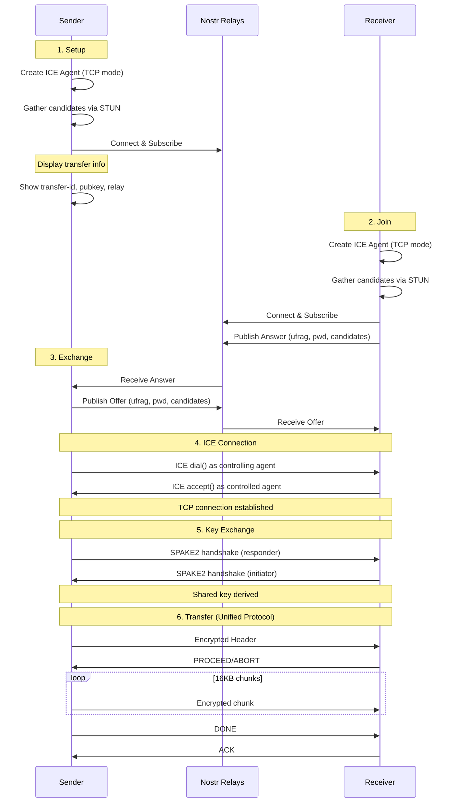

# ICE Transport Architecture

## Overview

The ICE transport uses `webrtc-ice` for NAT traversal with TCP candidates, providing a reliable byte stream for the unified transfer protocol.

## Why ICE Instead of Full WebRTC?

| Aspect | Full WebRTC | ICE-Only |
|--------|-------------|----------|
| Stack | SCTP/DTLS/DataChannel | TCP via ICE |
| Complexity | High | Low |
| Binary size | ~5MB | ~1MB |
| Protocol | Custom datagram-based | Unified stream-based |
| Compatibility | WebRTC only | Same as iroh/Tor/mDNS |

By using TCP candidates only, we get ordered, reliable byte streams that work directly with our unified transfer protocol.

## Connection Flow



## Module Structure

```
src/ice/
├── mod.rs        # Module exports
├── agent.rs      # ICE agent wrapper (IceTransport)
├── conn.rs       # AsyncRead/AsyncWrite adapter (IceConn)
├── signaling.rs  # Nostr signaling for ICE
├── sender.rs     # Send file via ICE
└── receiver.rs   # Receive file via ICE
```

## Key Components

### IceTransport (agent.rs)

Wraps `webrtc-ice::Agent` configured for TCP candidates:

```rust
let config = AgentConfig {
    urls: stun_urls,
    network_types: vec![NetworkType::Tcp4, NetworkType::Tcp6],
    ..Default::default()
};
```

Key methods:
- `new()` - Create agent with default STUN servers
- `gather_candidates()` - Start gathering ICE candidates
- `get_local_credentials()` - Get ufrag/pwd for signaling
- `dial()` - Connect as controlling agent (sender)
- `accept()` - Connect as controlled agent (receiver)

### IceConn (conn.rs)

Bridges `webrtc_util::Conn` (async send/recv) to tokio's `AsyncRead/AsyncWrite`:

```rust
impl AsyncRead for IceConn { ... }
impl AsyncWrite for IceConn { ... }
```

This allows using the unified transfer protocol directly:
```rust
run_sender_transfer(&mut file, &mut ice_conn, &key, &header).await?;
run_receiver_transfer(ice_conn, key, output_dir, no_resume).await?;
```

### Signaling (signaling.rs)

ICE signaling payload exchanged via Nostr:

```rust
struct IceSignalingPayload {
    ufrag: String,           // ICE username fragment
    pwd: String,             // ICE password
    candidates: Vec<IceCandidateInfo>,
}
```

Message types:
- `ice-offer` - Sender's credentials + candidates
- `ice-answer` - Receiver's credentials + candidates

## Security Model

### Key Exchange

Unlike the old WebRTC implementation which pre-shared an AES key in the wormhole code, ICE transport uses SPAKE2:

1. Transfer ID serves as the shared password
2. SPAKE2 derives a session key from transfer ID
3. All data encrypted with AES-256-GCM using derived key

This provides:
- Forward secrecy (new key per transfer)
- No key in signaling messages
- Same security model as other transports

### Signaling Privacy

ICE credentials (ufrag/pwd) and candidates are sent via Nostr in base64-encoded JSON. This reveals:
- IP addresses in ICE candidates
- Transfer ID (public identifier)

It does NOT reveal:
- File contents (encrypted after SPAKE2)
- Encryption keys (derived via SPAKE2)

## Wire Protocol

Uses the unified transfer protocol (same as iroh, Tor, mDNS):

```
Header:   [length: 4 bytes BE][encrypted JSON header]
Data:     [encrypted 16KB chunk]...
Control:  [encrypted PROCEED/ABORT/DONE/ACK]
```

See `wormhole-common/src/core/transfer.rs` for protocol details.

## NAT Traversal

### STUN Servers

Default STUN servers for candidate gathering:
- `stun:stun.l.google.com:19302`
- `stun:stun1.l.google.com:19302`

### TCP Candidates

We use TCP candidates exclusively because:
1. Provides reliable, ordered byte stream
2. Works with unified protocol (no datagram framing needed)
3. Better compatibility with firewalls

Types of TCP candidates:
- **Host**: Direct connection on local IP
- **Server-reflexive**: Public IP discovered via STUN
- **Relay**: Via TURN server (not yet implemented)

## Limitations

1. **TCP only** - No UDP for lossy scenarios (fine for file transfer)
2. **No TURN** - Fails if both peers are behind symmetric NAT
3. **Nostr required** - No offline signaling mode yet

## Resume Support

File transfers support resume automatically via the unified protocol:
- Receiver checks for existing partial downloads
- If checksum matches, resumes from last position
- Folders are NOT resumable (checksum = 0)

## Future Work

- [ ] Offline/manual signaling (copy-paste credentials)
- [ ] TURN relay support
