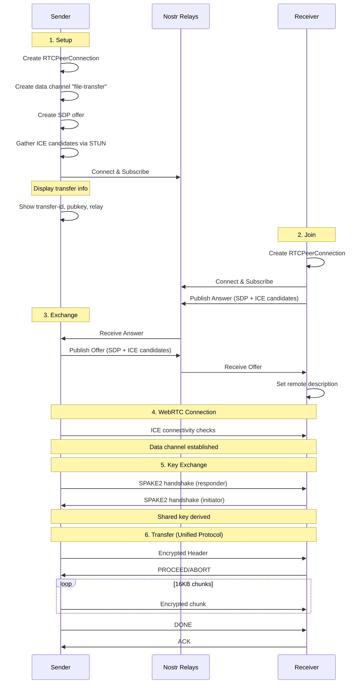

# WebRTC Transport Architecture

## Overview

The WebRTC transport uses the full WebRTC stack (`webrtc` crate) with RTCPeerConnection and RTCDataChannel for peer-to-peer file transfers with NAT traversal.

## Connection Flow



## Module Structure

```
src/
├── main.rs           # CLI entry point
├── webrtc/
│   ├── mod.rs        # Module exports
│   ├── common.rs     # WebRtcPeer, DataChannelStream
│   ├── sender.rs     # Send file via WebRTC
│   ├── receiver.rs   # Receive file via WebRTC
│   ├── offline_sender.rs    # Offline/manual signaling sender
│   └── offline_receiver.rs  # Offline/manual signaling receiver
└── signaling/
    ├── mod.rs        # Module exports
    ├── nostr.rs      # Nostr relay signaling
    └── offline.rs    # Copy-paste signaling helpers
```

## Key Components

### WebRtcPeer (common.rs)

Wraps `RTCPeerConnection` with STUN configuration:

```rust
let ice_servers = vec![RTCIceServer {
    urls: vec!["stun:stun.l.google.com:19302".to_owned()],
    ..Default::default()
}];

let config = RTCConfiguration { ice_servers, ..Default::default() };
let peer_connection = api.new_peer_connection(config).await?;
```

Key methods:
- `new()` - Create peer connection with default STUN servers
- `new_offline()` - Create peer connection without STUN (LAN only)
- `create_data_channel()` - Create named data channel
- `create_offer()` / `create_answer()` - SDP negotiation
- `gather_ice_candidates()` - Collect all ICE candidates (vanilla ICE)
- `get_connection_info()` - Get connection type (Host/STUN/Relay)

### DataChannelStream (common.rs)

Bridges `RTCDataChannel` to tokio's `AsyncRead/AsyncWrite`:

```rust
impl AsyncRead for DataChannelStream { ... }
impl AsyncWrite for DataChannelStream { ... }
```

This allows using the unified transfer protocol directly:
```rust
run_sender_transfer(&mut file, &mut stream, &key, &header).await?;
run_receiver_transfer(stream, key, output_dir, no_resume).await?;
```

Features:
- Message buffering with overflow detection
- Graceful close handling
- Non-blocking write operations

### Signaling (signaling/nostr.rs)

SDP and ICE candidates are exchanged via Nostr relays:

Message types:
- `webrtc-offer` - Sender's SDP offer + ICE candidates
- `webrtc-answer` - Receiver's SDP answer + ICE candidates

## Security Model

### Key Exchange

The WebRTC transport uses SPAKE2 for key derivation:

1. Transfer ID serves as the shared password
2. SPAKE2 derives a session key from transfer ID
3. All data encrypted with AES-256-GCM using derived key

This provides:
- Forward secrecy (new key per transfer)
- No key in signaling messages
- Same security model as other transports

### Transport Security

WebRTC provides built-in security:
- **DTLS**: All data channel traffic is encrypted
- **SRTP**: Media streams are encrypted (not used here)
- **ICE consent**: Periodic connectivity verification

The application layer adds AES-256-GCM encryption on top for defense in depth.

### Signaling Privacy

SDP offers/answers and ICE candidates are sent via Nostr. This reveals:
- IP addresses in ICE candidates
- Transfer ID (public identifier)

It does NOT reveal:
- File contents (encrypted after SPAKE2)
- Encryption keys (derived via SPAKE2)

## Wire Protocol

Uses the unified transfer protocol (same as iroh, Tor, mDNS):

```
Header:   [length: 4 bytes BE][encrypted JSON header]
Data:     [encrypted 16KB chunk]...
Control:  [encrypted PROCEED/ABORT/DONE/ACK]
```

See `wormhole-common/src/core/transfer.rs` for protocol details.

## NAT Traversal

### STUN Server

Default STUN server for candidate gathering:
- `stun:stun.l.google.com:19302`

### Connection Types

WebRTC attempts connections in order of preference:
- **Host**: Direct connection on local IP (same network)
- **Server-reflexive**: Public IP discovered via STUN (NAT traversal)
- **Peer-reflexive**: Discovered during connectivity checks

If WebRTC connection fails (e.g., both peers behind symmetric NAT), use Tor mode from the main `wormhole-rs` program as a relay fallback.

### Connection Info

After connection, `get_connection_info()` returns the actual connection type:
```
Connection type: Direct (Host)
Local: 192.168.1.100:54321
Remote: 192.168.1.101:12345
```

## Limitations

1. **Symmetric NAT** - Direct connection fails if both peers are behind symmetric NAT; use Tor mode as fallback

## Resume Support

File transfers support resume automatically via the unified protocol:
- Receiver checks for existing partial downloads
- If checksum matches, resumes from last position
- Folders are NOT resumable (checksum = 0)

