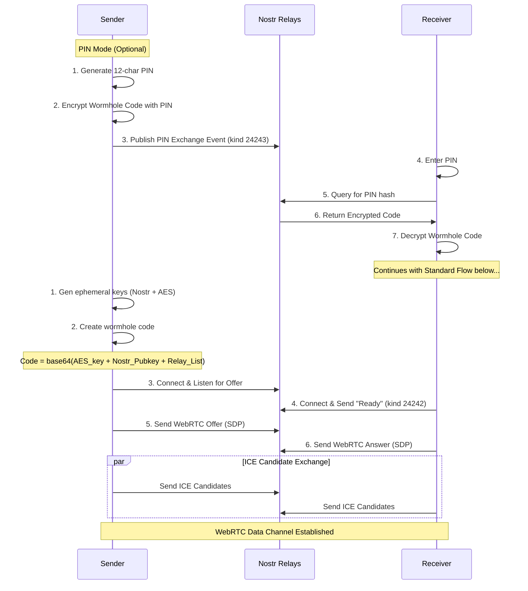
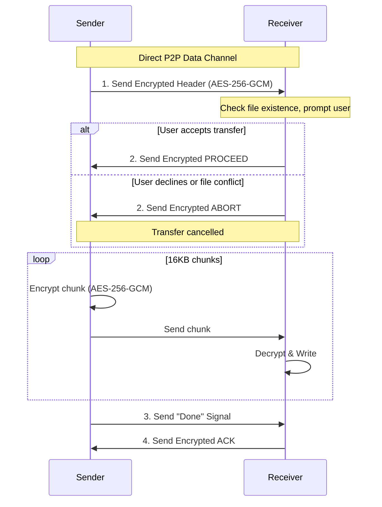

# WebRTC Transport Architecture

> **Note**: The WebRTC transport is a legacy/experimental feature. For new users, we recommend using **iroh mode** (`send-iroh`) which provides better reliability and simpler setup.

## Overview

WebRTC mode uses WebRTC Data Channels for peer-to-peer file transfer with Nostr relays for signaling, or optional copy/paste manual signaling (`--manual-signaling`).

## Transfer Flow

### 1. Signaling (WebRTC + Nostr)



### 2. Data Transfer (WebRTC Path)



### Manual Signaling (Copy/Paste, Offline-Friendly)

Used when relays are blocked or unavailable (`--manual-signaling`). Signaling blobs are base64url-encoded JSON with CRC32 checksums; they expire under the same TTL checks as wormhole codes.

1. Sender gathers ICE candidates (STUN only) and prints an offer blob containing SDP, ICE candidates, filename/size/type, and a hex AES-256-GCM key.
2. Receiver pastes the blob, validates checksum/TTL, sets the remote description, and returns an answer blob with SDP + ICE.
3. Sender pastes the answer, completes WebRTC setup, and transfers over the encrypted data channel.

## Connection Details

### WebRTC Mode (`wormhole-rs send-webrtc`)
- **Transport**: WebRTC Data Channels (SCTP/DTLS)
- **Signaling**: Nostr Relays (JSON payloads) by default; copy/paste manual signaling available with `--manual-signaling`
  - Default: Auto-discovers best relays via NIP-65/NIP-66, probes for capability and latency
  - Custom: Use `--nostr-relay wss://...` for specific Nostr relays
  - Fallback: Use `--use-default-relays` to skip discovery and use hardcoded defaults
- **NAT traversal**: STUN (no built-in TURN); if direct P2P fails, use Tor mode for relay
- **Encryption**: Mandatory AES-256-GCM for all application data (on top of DTLS).

## Security Model

### WebRTC Mode Encryption (WebRTC + Nostr)
Since signaling happens over public relays, we cannot trust the transport for key exchange.
- **Key Exchange**: Ephemeral AES-256 key generated by sender, carried in the wormhole code (Nostr signaling) or inside the manual-offer blob (`--manual-signaling`).
- **Confidentiality**: All data (headers, chunks, and control signals) is encrypted with AES-256-GCM BEFORE sending over the data channel.
- **Signaling Privacy**: Metadata (SDP, ICE) is currently sent in plaintext JSON events (Kinds 24242). This reveals IP addresses to relays but NOT file contents. Manual signaling uses copy/paste blobs without relays.

## Wire Protocol Format

### WebRTC Message Format

WebRTC uses a message-based protocol with a type byte prefix:

```
Header/Control: [type: 1 byte][length: 4 bytes BE][encrypted_payload]
Data Chunk:     [type: 1 byte][chunk_num: 8 bytes BE][length: 4 bytes BE][encrypted_payload]
```

| Type Byte | Message | Encrypted | Format |
|-----------|---------|-----------|--------|
| 0 | Header | Yes | `[0][len][encrypted]` |
| 1 | Data Chunk | Yes | `[1][chunk_num][len][encrypted]` |
| 2 | Done Signal | Yes | `[2][len][encrypted]` |
| 3 | ACK | Yes | `[3][len][encrypted]` |
| 4 | PROCEED | Yes | `[4][len][encrypted]` |
| 5 | ABORT | Yes | `[5][len][encrypted]` |

**Control Signal Encryption (Types 2, 3, 4, 5):**

WebRTC control signals use the same nonce derivation as stream-based transports. The type byte is used only for message routing—the encrypted payload uses the reserved chunk numbers:

- **Type 2 (DONE)**: Encrypts `b"DONE"` with chunk number `u64::MAX - 3`
- **Type 3 (ACK)**: Encrypts `b"ACK"` with chunk number `u64::MAX - 2`
- **Type 4 (PROCEED)**: Encrypts `b"PROCEED"` with chunk number `u64::MAX`
- **Type 5 (ABORT)**: Encrypts `b"ABORT"` with chunk number `u64::MAX - 1`

This ensures identical encryption behavior across all transports, with WebRTC simply adding a routing prefix.
