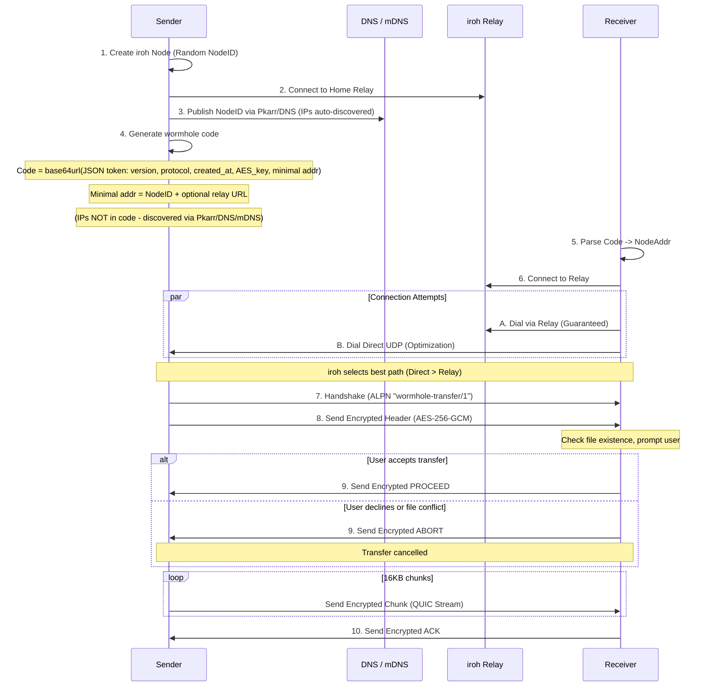
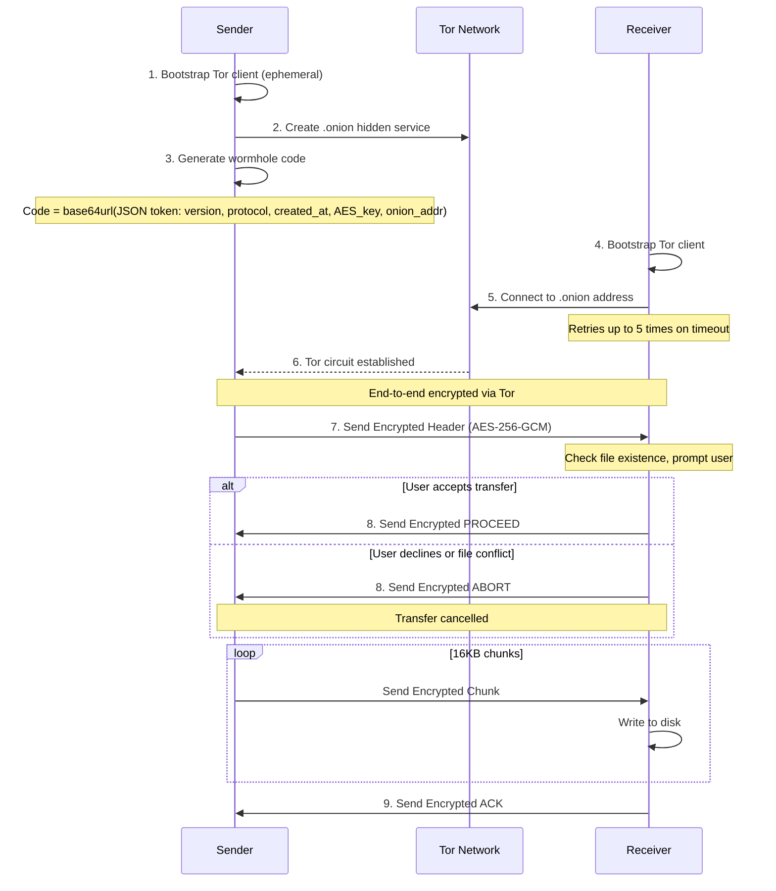
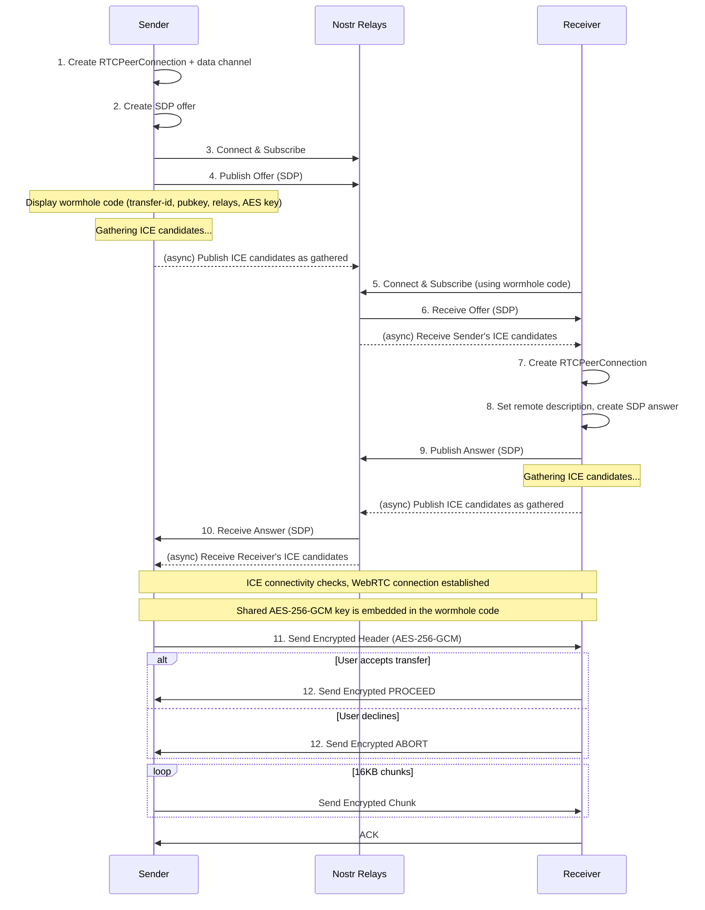
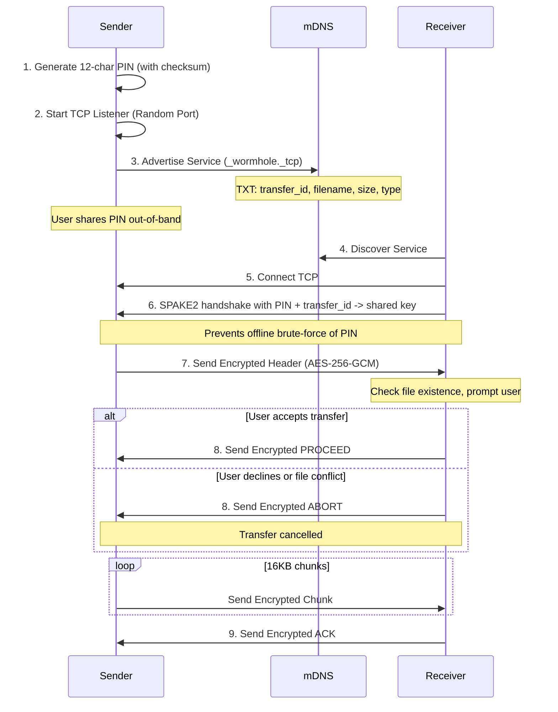

# Wormhole-rs Architecture

## Overview

This document provides a detailed walkthrough of the wormhole-rs implementation.

wormhole-rs supports two main categories of transport:

1. **Internet Transfers** (wormhole code based):
    - **iroh Mode** (Recommended) - Direct P2P transfers using iroh's QUIC/TLS stack (automatic relay fallback) via `wormhole-rs send`
    - **Tor Mode**: Anonymous transfers via Tor hidden services (uses `arti`) via `wormhole-rs send-tor`
    - **WebRTC Mode**: Direct P2P via WebRTC DataChannels with Nostr signaling via `wormhole-rs-webrtc send`
2. **Local Transfers** (using `wormhole-rs-local send`):
    - **mDNS Mode**: LAN-only transfers using mDNS discovery + TCP with SPAKE2 key exchange driven by a 12-character PIN

## Transfer Flows

### 1. Internet Transfers (Wormhole Code)

#### iroh Mode (Recommended) - QUIC / Direct + Relay

iroh uses a "hole punching" strategy that attempts direct connections via UDP/QUIC while simultaneously establishing a fallback path through a Relay (DERP) server.



#### Tor Mode



#### WebRTC Mode



### 2. Local Transfers (LAN)

#### Local Mode (mDNS + TCP)

Local mode is designed for transfers on the same LAN without internet access. It uses a SPAKE2 PAKE to derive the session key from a short PIN, preventing offline dictionary attacks.



## Connection Types/Modes

### iroh Mode (`wormhole-rs send`) - Recommended
- **Transport**: QUIC / TLS 1.3
- **Discovery**: iroh's global discovery (n0 DNS / pkarr) + mDNS for local network.
- **Relay**: iroh relays (DERP) - automatically used if direct P2P connection fails.
- **Failover**: Uses multiple relays for redundancy; monitors latency to select the best path.
- **Connection**: "Hole punching" attempts to establish a direct UDP connection; falls back to relay if NATs are strict.
- **Protocol**: ALPN `wormhole-transfer/1`.
- **Encryption**: Always AES-256-GCM encrypted at the application layer, plus QUIC/TLS encryption.

### Local Mode (`wormhole-rs-local send`)
- **Transport**: Raw TCP
- **Discovery**: mDNS (Multicast DNS)
- **Key Exchange**: SPAKE2 using a 12-character PIN + transfer_id (prevents offline dictionary attacks)
- **Encryption**: Mandatory AES-256-GCM using SPAKE2-derived key
- **Port**: Random ephemeral port

### Tor Mode (`wormhole-rs send-tor`)
- **Transport**: Tor Onion Services
- **Discovery**: Onion Address
- **Encryption**: Tor circuit encryption plus mandatory AES-256-GCM at the application layer.

### WebRTC Mode (`wormhole-rs-webrtc send`)
- **Transport**: WebRTC DataChannel over DTLS
- **Discovery**: Nostr relays for SDP/ICE signaling (or manual copy-paste)
- **NAT Traversal**: ICE with STUN server (`stun:stun.l.google.com:19302`)
- **Encryption**: DTLS (WebRTC built-in) + AES-256-GCM at application layer
- **Fallback**: Use Tor mode if both peers are behind symmetric NAT

## Security Model

### iroh Mode Encryption (Dual Layer)
iroh mode uses two encryption layers for defense in depth:

**Transport Layer (iroh/QUIC)**:
- TLS 1.3/QUIC encryption (cipher negotiated by iroh/quinn)
- Mutual authentication via iroh node identities (NodeID in wormhole code)

**Application Layer (wormhole-rs)**:
- AES-256-GCM encryption for all data: headers, chunks, and control signals
- 256-bit key generated per transfer, embedded in wormhole code

### WebRTC Mode Encryption (Dual Layer)
WebRTC mode uses two encryption layers for defense in depth:

**Transport Layer (WebRTC/DTLS)**:
- DTLS encryption for all data channel traffic
- ICE consent for periodic connectivity verification

**Application Layer (wormhole-rs)**:
- AES-256-GCM encryption for all data: headers, chunks, and control signals
- Per-transfer random key embedded in the wormhole code

### PIN-based Key Exchange (Local Mode)
- **Format**: 12 characters (11 random + 1 checksum) from an unambiguous charset; the checksum catches typos before attempting a connection.
- **Key Derivation**: The PIN is fed into SPAKE2 (with transfer_id as context) to derive the session key; no salts are advertised in mDNS TXT records.
- **Security**: SPAKE2 prevents offline dictionary attacks and rejects wrong transfer_id.

### Local Mode Encryption
- **Key Exchange**: SPAKE2 PAKE using the user-shared PIN and transfer_id.
- **Confidentiality**: All data (headers, chunks, and control signals) over TCP is AES-256-GCM encrypted with the SPAKE2-derived key.

### Tor Mode Security
- **Anonymity**: Sender/Receiver IPs hidden.
- **Encryption**: End-to-end via Tor circuit encryption plus mandatory AES-256-GCM at application layer for all data (headers, chunks, and control signals).

### TTL (Time-To-Live) Validation

All wormhole codes and signaling offers include a creation timestamp and are validated against a TTL to prevent replay attacks and stale session establishment.

**Implementation:**
- **Token Version**: v4 tokens include a `created_at` Unix timestamp
- **TTL Duration**: 30 minutes (`CODE_TTL_SECS = 1800`)
- **Clock Skew**: Allows up to 60 seconds into the future to handle minor clock drift

**Validation Points:**
1. **Wormhole Codes** (iroh/tor/webrtc via Nostr): Validated in `parse_code()` before connection
2. **Manual Signaling Offers** (`send-manual`/`receive-manual` WebRTC): Validated in `read_offer_json()` before WebRTC handshake

**Not used for mDNS (Local Mode):**
TTL validation is not applied to local mDNS transfers because it is unnecessary:
- The mDNS service advertisement is ephemeral and disappears when the sender exits
- There is no persistent code/token that could be stored and replayed later
- The connection happens immediately over direct TCP on the LAN

**Error Messages:**
- Expired codes: "Token expired: code is X minutes old (max 30 minutes). Please request a new code from the sender."
- Future timestamps: "Invalid token: created_at is in the future. Check system clock."

## Wire Protocol Format

### Encrypted Message Format (Stream-based transports)

All encrypted messages (used by Iroh, Tor, and mDNS modes) follow this format:

```
[length: 4 bytes BE][encrypted_payload]
```

- **length**: Big-endian u32 indicating total size of `encrypted_payload`
- **encrypted_payload**: `nonce (12 bytes) || ciphertext || tag (16 bytes)`

### Control Signals

Control signals are encrypted messages sent over the same length-prefixed framing as data:

- **PROCEED**: receiver accepts transfer
- **ABORT**: receiver declines transfer
- **ACK**: receiver confirms all expected bytes were received
- **RESUME:<offset>**: receiver requests resume from a byte offset (files only)

These signals are not tied to chunk numbers and use fresh random nonces like all other encrypted messages.

### WebRTC Message Format

WebRTC uses the same length-prefixed encrypted framing as stream transports. The
`DataChannelStream` adapter bridges WebRTC's `RTCDataChannel` to tokio's
`AsyncRead/AsyncWrite`, so the unified protocol works without special-casing.

### Nonce Derivation

AES-256-GCM requires a unique 12-byte nonce for each encryption operation with
the same key. wormhole-rs generates a fresh random 96-bit nonce per message and
prefixes it to the ciphertext, so the receiver can decrypt directly. With 16KB
chunks and a per-transfer key, the conservative 2^32 random-nonce limit
corresponds to ~64 TiB per transfer.

### Confirmation Handshake

Before data transfer begins, the receiver validates the incoming transfer:

1. **Sender** sends encrypted file header containing filename, size, and transfer type
2. **Receiver** checks:
   - If file already exists at destination
   - If user wants to proceed (interactive prompt)
3. **Receiver** responds with:
   - **PROCEED**: Accept transfer, sender begins sending data chunks
   - **ABORT**: Decline transfer, connection is closed

This handshake prevents:
- Accidental file overwrites without user consent
- Wasted bandwidth on declined transfers
- Sender continuing after receiver has disconnected
