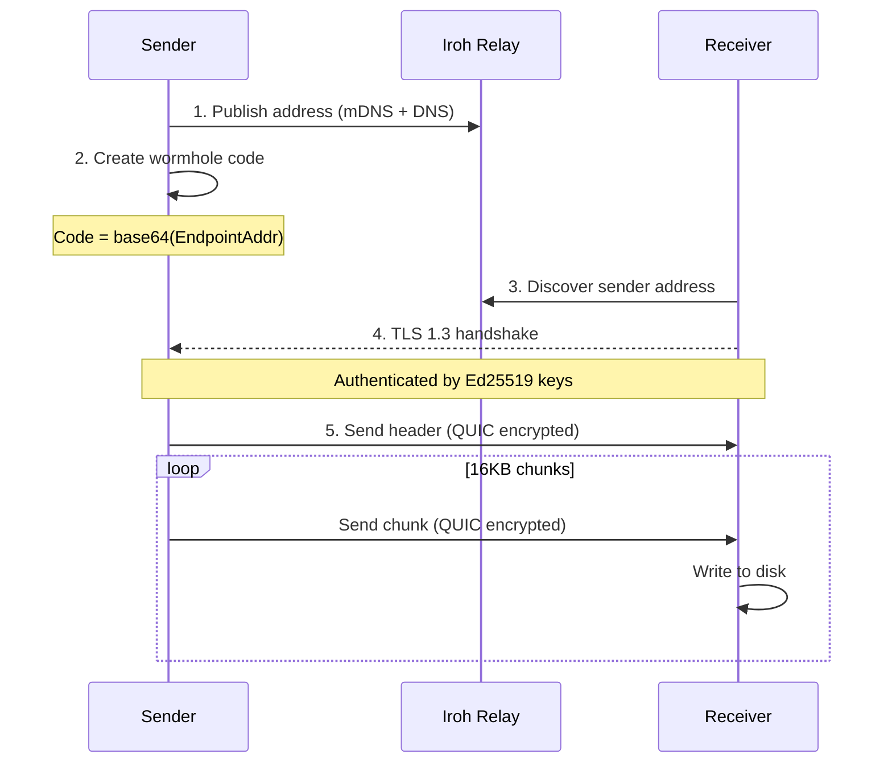
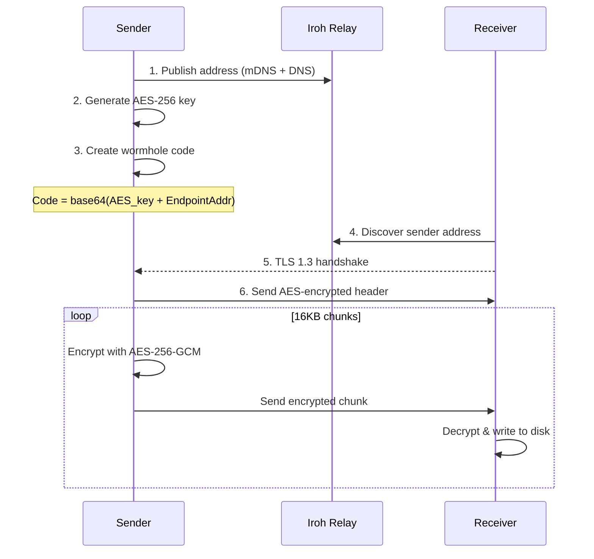
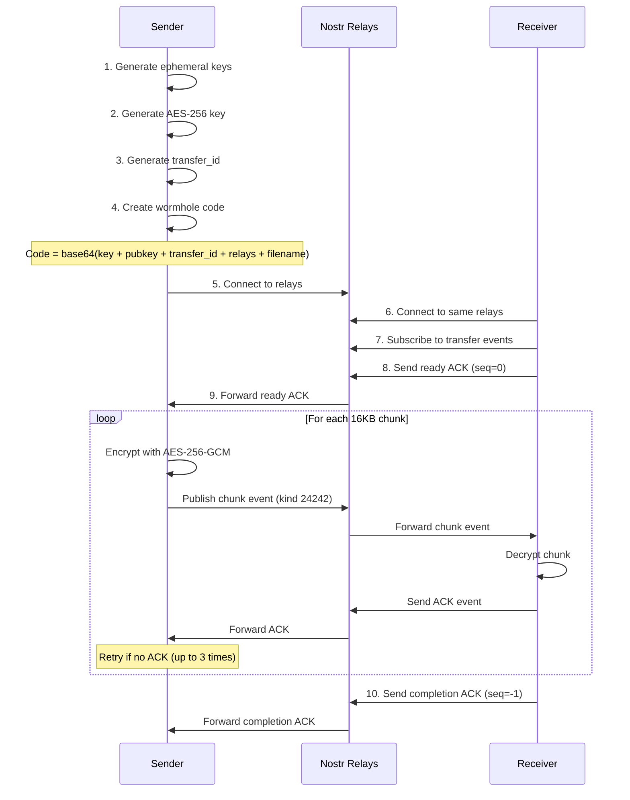

# Wormhole-rs Architecture

## Overview

This document provides a detailed walkthrough of the wormhole-rs implementation.

wormhole-rs supports two transport modes:
- **iroh mode** - Direct P2P transfers using iroh's QUIC/TLS stack
- **Nostr mode** - Small file transfers (≤512KB) via Nostr relays with mandatory encryption

## Protocol Flow

### iroh Mode - Default (Relies on iroh's QUIC/TLS)



### iroh Mode - Extra Encryption (`--extra-encrypt`)



### Nostr Mode



## Connection Types

### iroh Mode

| Type | Description |
|------|-------------|
| `Direct(addr)` | Direct UDP P2P (fastest, no relay involved) |
| `Relay(url)` | Via relay server (works through strict NAT) |
| `Mixed` | Both available, upgrading to direct |

### Nostr Mode

Nostr mode always uses relays - there is no direct P2P connection. Sender and receiver must connect to at least one common relay.

## Module Descriptions

### `crypto.rs`
AES-256-GCM encryption/decryption used by both modes:
- `generate_key()` - Creates 256-bit random key
- `encrypt_chunk(key, chunk_num, data)` - Encrypts with unique nonce
- `decrypt_chunk(key, chunk_num, data)` - Decrypts and verifies
- Optional for iroh mode (`--extra-encrypt`), mandatory for Nostr mode

### `wormhole.rs`
Wormhole code generation and parsing (version 2 tokens):

**iroh mode (default):**
```json
{
  "version": 2,
  "protocol": "iroh",
  "extra_encrypt": false,
  "key": null,
  "addr": <EndpointAddr>
}
```

**iroh mode (extra encryption):**
```json
{
  "version": 2,
  "protocol": "iroh",
  "extra_encrypt": true,
  "key": "<base64-encoded-32-bytes>",
  "addr": <EndpointAddr>
}
```

**Nostr mode:**
```json
{
  "version": 2,
  "protocol": "nostr",
  "extra_encrypt": true,
  "key": "<base64-encoded-32-bytes>",
  "addr": null,
  "nostr_sender_pubkey": "<hex>",
  "nostr_relays": ["wss://..."],
  "nostr_transfer_id": "<hex>",
  "nostr_filename": "file.txt"
}
```

### `transfer.rs`
Wire protocol implementation for iroh mode:

**Default mode:**
- Header: `len(u32) || transfer_type || filename_len || name || size`
- Chunks: `len(u32) || data`

**Extra encryption mode:**
- Encrypted header: `len(u32) || nonce || ciphertext || tag`
- Encrypted chunks: `len(u32) || nonce || ciphertext || tag`

### `sender.rs` (iroh mode)
1. Creates iroh Endpoint with N0 + mDNS discovery
2. Optionally generates encryption key (if `--extra-encrypt`)
3. Creates wormhole code and waits for receiver
4. Streams header + chunks (optionally encrypted)

### `receiver.rs` (iroh mode)
1. Parses wormhole code to extract address (and key if encrypted)
2. Connects to sender via TLS 1.3 (direct or via relay)
3. Displays connection type (Direct/Relay/Mixed)
4. Receives data, optionally decrypts, writes to output file

### `folder_sender.rs` / `folder_receiver.rs` (iroh mode)
Same as file transfer but:
- Creates tar archive of folder before sending
- Extracts tar archive after receiving
- Preserves file modes (Unix) where supported

### `nostr_protocol.rs` (Nostr mode)
Nostr protocol implementation:
- Event structures (kind 24242, ephemeral range)
- `create_chunk_event()` - Build chunk event with encrypted data
- `create_ack_event()` - Build ACK event
- `parse_chunk_event()` - Extract chunk data and metadata
- `parse_ack_event()` - Extract ACK sequence number
- `generate_transfer_id()` - Random 16-byte hex ID
- `get_best_relays()` - Fetch from nostr.watch API or use defaults
- Constants: `NOSTR_CHUNK_SIZE = 16KB`, `DEFAULT_NOSTR_RELAYS`

### `nostr_sender.rs` (Nostr mode)
1. Validates file size ≤ 512KB
2. Generates ephemeral Nostr keypair
3. Generates AES-256 key (always required)
4. Connects to Nostr relays (from API, custom, or defaults)
5. Generates wormhole code with Nostr metadata
6. Waits for receiver ready signal (ACK seq=0)
7. Sends encrypted chunks as Nostr events
8. Waits for ACK after each chunk (30s timeout, 3 retries)
9. Waits for completion ACK (seq=-1)

### `nostr_receiver.rs` (Nostr mode)
1. Parses wormhole code for Nostr metadata
2. Generates ephemeral Nostr keypair
3. Connects to relays specified in wormhole code (no override)
4. Subscribes to chunk events (filter by transfer_id and sender pubkey)
5. Sends ready ACK (seq=0)
6. Collects chunks into HashMap by sequence number
7. Sends ACK for each received chunk
8. Decrypts chunks with AES-256-GCM
9. Reassembles and writes to file atomically (NamedTempFile)
10. Sends completion ACK (seq=-1)

## Security Model

### iroh's Built-in Encryption (Default)

iroh v0.95.1 provides three layers of encryption:

| Layer | Algorithm | Purpose |
|-------|-----------|---------|
| Discovery | ChaCha20-Poly1305 | Encrypts address discovery messages |
| Transport | TLS 1.3 (RFC 7250) | Authenticates connection, derives session keys |
| Stream | QUIC AEAD | Encrypts all packet data |

**Key insight**: The relay server cannot read transferred data because:
1. TLS handshake requires sender's Ed25519 SecretKey (never transmitted)
2. Session keys are derived from handshake (relay doesn't have them)
3. All QUIC packets are encrypted with session keys

### Out-of-Band Code Sharing

The wormhole code is shared manually (copy/paste, voice, etc.):
- Default: Contains only the sender's public address
- Extra encryption: Contains AES key + address

### Why Extra Encryption Exists

The `--extra-encrypt` flag adds AES-256-GCM on top of QUIC/TLS for:
- Defense-in-depth (protects against potential iroh vulnerabilities)
- Future insecure transports (TURN servers, WebRTC)
- Users who want encryption key in the wormhole code

### Nonce Strategy (Extra Encryption Mode)

- Each chunk uses nonce derived from chunk number (counter mode)
- Prevents nonce reuse across chunks
- Receiver verifies nonce matches expected chunk number

## Protocol Compatibility

**Breaking change**: The default mode (no extra encryption) produces different wormhole codes than previous versions. Clients must use matching modes:

| Sender | Receiver | Compatible? |
|--------|----------|-------------|
| Default | Default | Yes |
| `--extra-encrypt` | `--extra-encrypt` | Yes |
| Default | `--extra-encrypt` | No |
| `--extra-encrypt` | Default | No |
