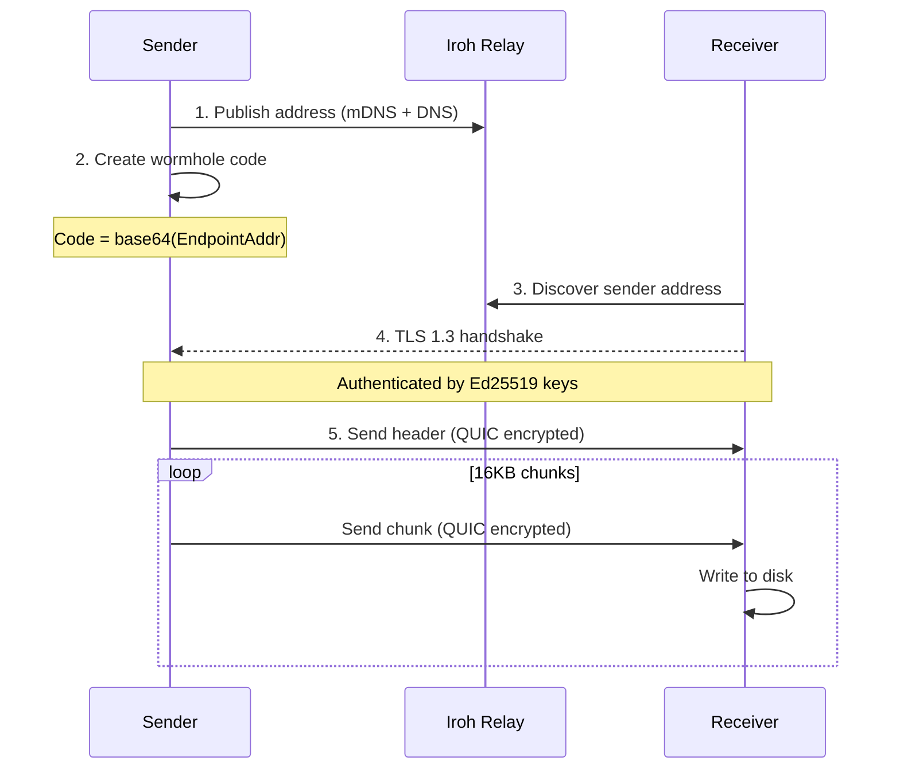
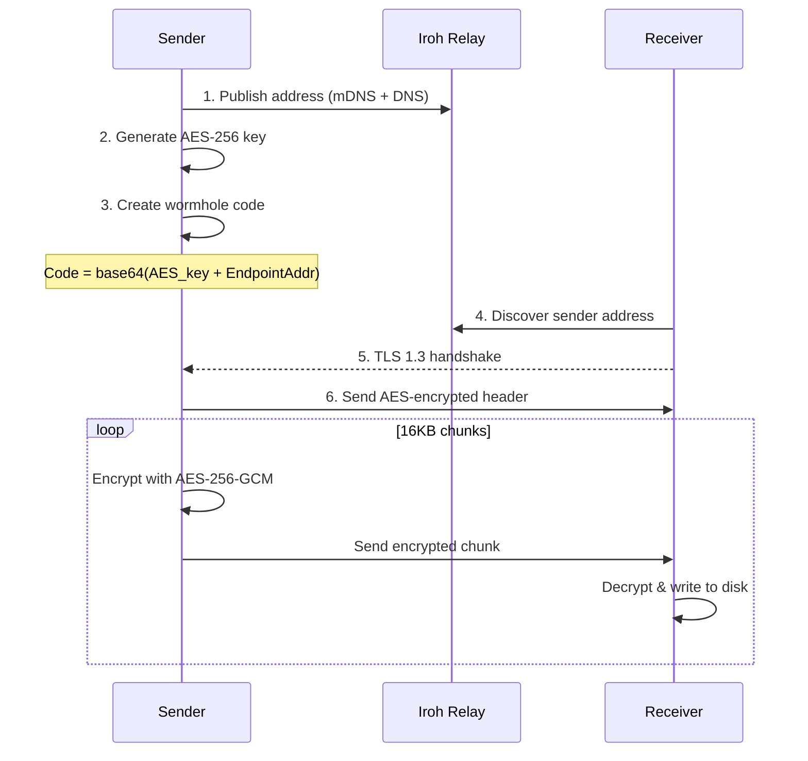

# Wormhole-rs Architecture

## Overview

This document provides a detailed walkthrough of the wormhole-rs implementation.

## Protocol Flow

### Default Mode (Relies on iroh's QUIC/TLS)

### Extra Encryption Mode (`--extra-encrypt`)

## Connection Types

| Type | Description |
|------|-------------|
| `Direct(addr)` | Direct UDP P2P (fastest, no relay involved) |
| `Relay(url)` | Via relay server (works through strict NAT) |
| `Mixed` | Both available, upgrading to direct |

## Module Descriptions

### `crypto.rs`
Optional AES-256-GCM encryption for `--extra-encrypt` mode:
- `generate_key()` - Creates 256-bit random key
- `encrypt_chunk(key, chunk_num, data)` - Encrypts with unique nonce
- `decrypt_chunk(key, chunk_num, data)` - Decrypts and verifies

### `wormhole.rs`
Wormhole code generation and parsing:

**Default mode:**
- Format: `base64(postcard(EndpointAddr))`
- Contains: iroh EndpointAddr only

**Extra encryption mode:**
- Format: `base64(postcard(AES_key + EndpointAddr))`
- Contains: encryption key + iroh EndpointAddr

### `transfer.rs`
Wire protocol implementation:

**Default mode:**
- Header: `len(u32) || transfer_type || filename_len || name || size`
- Chunks: `len(u32) || data`

**Extra encryption mode:**
- Encrypted header: `len(u32) || nonce || ciphertext || tag`
- Encrypted chunks: `len(u32) || nonce || ciphertext || tag`

### `sender.rs`
1. Creates iroh Endpoint with N0 + mDNS discovery
2. Optionally generates encryption key (if `--extra-encrypt`)
3. Creates wormhole code and waits for receiver
4. Streams header + chunks (optionally encrypted)

### `receiver.rs`
1. Parses wormhole code to extract address (and key if encrypted)
2. Connects to sender via TLS 1.3 (direct or via relay)
3. Displays connection type (Direct/Relay/Mixed)
4. Receives data, optionally decrypts, writes to output file

### `folder_sender.rs` / `folder_receiver.rs`
Same as file transfer but:
- Creates tar archive of folder before sending
- Extracts tar archive after receiving
- Preserves file modes (Unix) where supported

## Security Model

### iroh's Built-in Encryption (Default)

iroh v0.95.1 provides three layers of encryption:

| Layer | Algorithm | Purpose |
|-------|-----------|---------|
| Discovery | ChaCha20-Poly1305 | Encrypts address discovery messages |
| Transport | TLS 1.3 (RFC 7250) | Authenticates connection, derives session keys |
| Stream | QUIC AEAD | Encrypts all packet data |

**Key insight**: The relay server cannot read transferred data because:
1. TLS handshake requires sender's Ed25519 SecretKey (never transmitted)
2. Session keys are derived from handshake (relay doesn't have them)
3. All QUIC packets are encrypted with session keys

See [SECURITY_AUDIT.md](SECURITY_AUDIT.md) for detailed analysis.

### Out-of-Band Code Sharing

The wormhole code is shared manually (copy/paste, voice, etc.):
- Default: Contains only the sender's public address
- Extra encryption: Contains AES key + address

### Why Extra Encryption Exists

The `--extra-encrypt` flag adds AES-256-GCM on top of QUIC/TLS for:
- Defense-in-depth (protects against potential iroh vulnerabilities)
- Future insecure transports (TURN servers, WebRTC)
- Users who want encryption key in the wormhole code

### Nonce Strategy (Extra Encryption Mode)

- Each chunk uses nonce derived from chunk number (counter mode)
- Prevents nonce reuse across chunks
- Receiver verifies nonce matches expected chunk number

## Protocol Compatibility

**Breaking change**: The default mode (no extra encryption) produces different wormhole codes than previous versions. Clients must use matching modes:

| Sender | Receiver | Compatible? |
|--------|----------|-------------|
| Default | Default | Yes |
| `--extra-encrypt` | `--extra-encrypt` | Yes |
| Default | `--extra-encrypt` | No |
| `--extra-encrypt` | Default | No |
