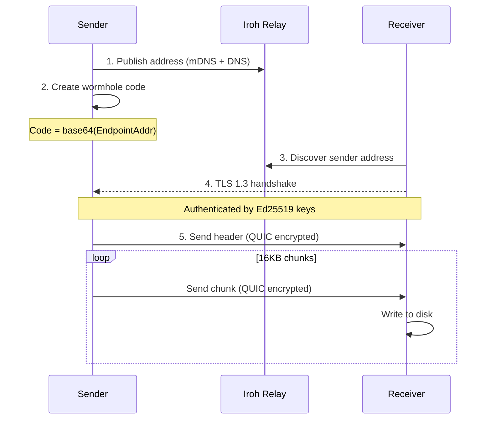
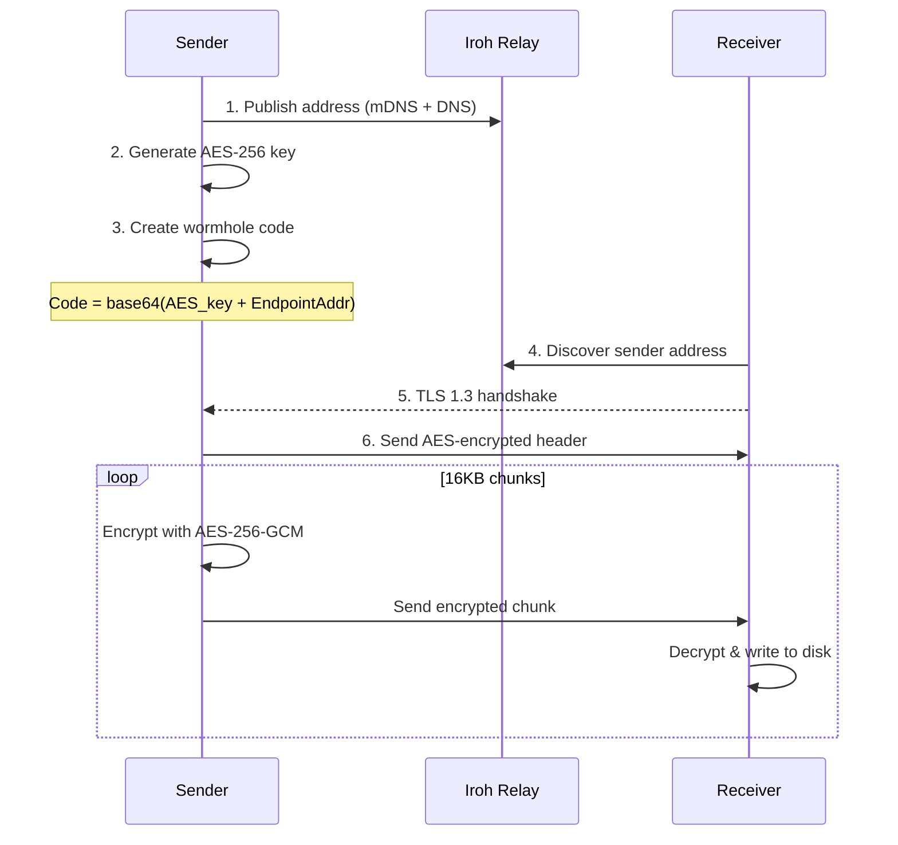
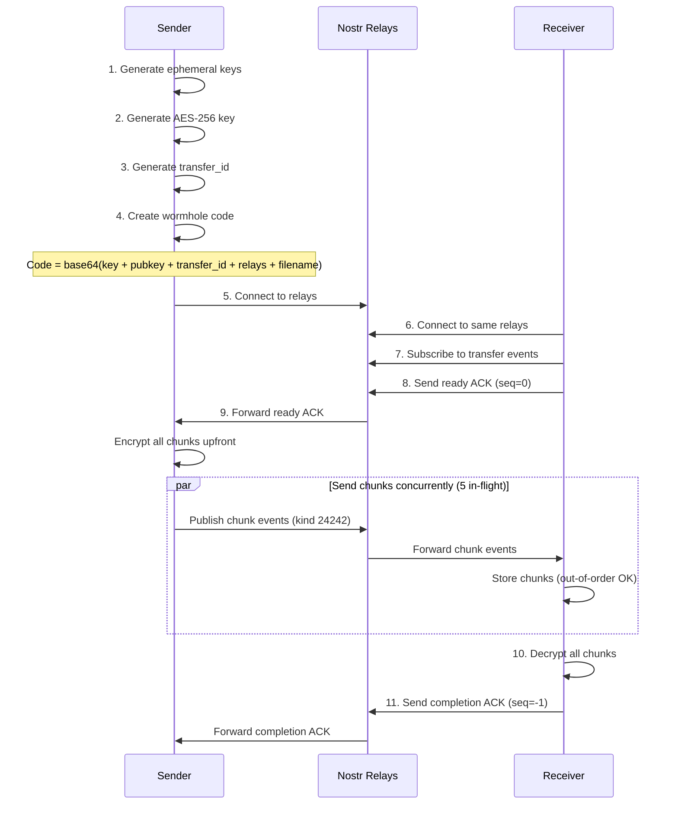
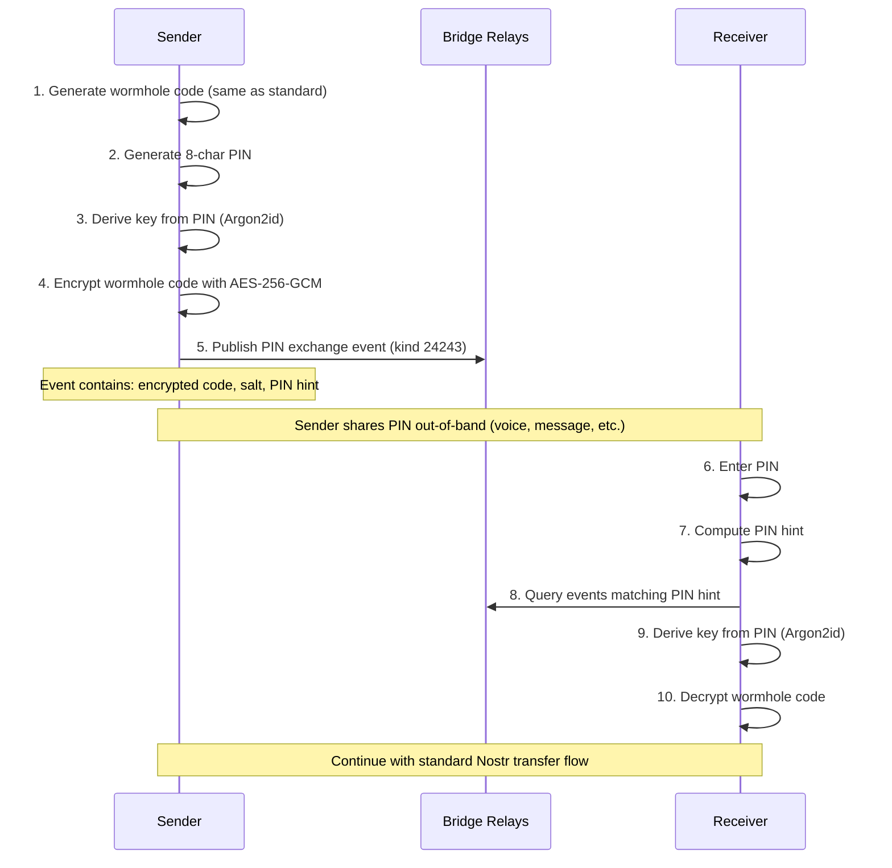
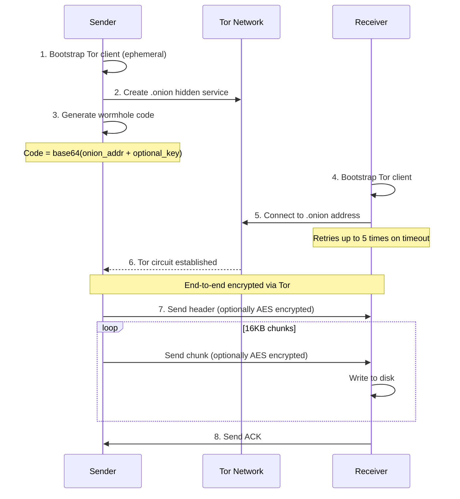

# Wormhole-rs Architecture

## Overview

This document provides a detailed walkthrough of the wormhole-rs implementation.

wormhole-rs supports three transport modes:
- **iroh mode** - Direct P2P transfers using iroh's QUIC/TLS stack (default)
- **Nostr mode** - Small file/folder transfers (≤512KB) via Nostr relays with mandatory encryption
- **Tor mode** - Anonymous transfers via Tor hidden services (.onion addresses) - requires `onion` feature

All modes support both file and folder transfers (folders are sent as tar archives).

## Protocol Flow

### iroh Mode - Default (Relies on iroh's QUIC/TLS)



### iroh Mode - Extra Encryption (`--extra-encrypt`)



### Nostr Mode (Standard)



### Nostr Mode with PIN (`--nostr-pin`)

PIN mode allows sharing a short 8-character PIN instead of the full wormhole code. The wormhole code is encrypted and published to Nostr relays.



**What Relays See vs. What They DON'T See:**

| Data | Visible to Relays? | Notes |
|------|-------------------|-------|
| PIN | **NO** | Never transmitted; shared out-of-band |
| Wormhole code | **NO** | Encrypted with PIN-derived key |
| AES-256 file encryption key | **NO** | Inside encrypted wormhole code |
| Argon2id salt | Yes | Required for key derivation; useless without PIN |
| PIN hint (8 hex chars) | Yes | SHA256 prefix; 4 bytes of entropy; cannot reverse to PIN |
| Encrypted file chunks | Yes | AES-256-GCM ciphertext; cannot decrypt without key |
| Transfer metadata | Yes | Transfer ID, chunk count, timestamps |

**PIN Exchange Event (kind 24243):**
```json
{
  "kind": 24243,
  "pubkey": "<sender_ephemeral_pubkey>",
  "content": "<base64(nonce || AES-GCM(wormhole_code) || tag)>",
  "tags": [
    ["h", "<pin_hint>"],
    ["s", "<base64(argon2_salt)>"],
    ["t", "<transfer_id>"],
    ["type", "pin_exchange"],
    ["expiration", "<unix_timestamp>"]
  ]
}
```

**PIN Security Properties:**

| Property | Value |
|----------|-------|
| PIN length | 8 characters |
| Character set | 67 chars: `A-Z` (no I,O) + `a-z` (no i,l,o) + `2-9` + `!@#$%^&*+-=?` |
| Entropy | ~49 bits (67^8 ≈ 4×10^14 combinations) |
| KDF | Argon2id (64 MiB memory, 3 iterations, 4 lanes) |
| Cipher | AES-256-GCM |
| Event TTL | 1 hour (NIP-40 expiration) |

**Brute-force resistance:** With Argon2id's 64 MiB memory cost, each PIN attempt takes ~0.5-1 second. Exhausting ~49 bits of entropy would take millions of years.

### Tor Mode



## Connection Types

### iroh Mode

| Type | Description |
|------|-------------|
| `Direct(addr)` | Direct UDP P2P (fastest, no relay involved) |
| `Relay(url)` | Via relay server (works through strict NAT) |
| `Mixed` | Both available, upgrading to direct |

### Nostr Mode

Nostr mode always uses relays - there is no direct P2P connection. Sender and receiver must connect to at least one common relay.

### Tor Mode

Tor mode uses .onion hidden services. All traffic is routed through the Tor network:
- Sender creates an ephemeral hidden service (new .onion address each transfer)
- Receiver connects via Tor circuit
- Both parties remain anonymous (IP addresses hidden)

## Module Descriptions

### `crypto.rs`
AES-256-GCM encryption/decryption — usage varies by mode:
- `generate_key()` - Creates 256-bit random key (iroh/Tor: only with `--extra-encrypt`; Nostr: always)
- `encrypt_chunk(key, chunk_num, data)` - Encrypts with unique nonce (iroh/Tor: optional; Nostr: mandatory)
- `decrypt_chunk(key, chunk_num, data)` - Decrypts and verifies (iroh/Tor: optional; Nostr: mandatory)

**Mode-specific usage:**
- **iroh mode**: Optional (`--extra-encrypt` flag) — iroh's QUIC/TLS provides baseline encryption
- **Tor mode**: Optional (`--extra-encrypt` flag) — Tor circuits provide baseline encryption
- **Nostr mode**: Mandatory — all chunks are AES-encrypted before publishing to relays

### `wormhole.rs`
Wormhole code generation and parsing (version 2 tokens):

**iroh mode (default):**
```json
{
  "version": 2,
  "protocol": "iroh",
  "extra_encrypt": false,
  "key": null,
  "addr": <EndpointAddr>
}
```

**iroh mode (extra encryption):**
```json
{
  "version": 2,
  "protocol": "iroh",
  "extra_encrypt": true,
  "key": "<base64-encoded-32-bytes>",
  "addr": <EndpointAddr>
}
```

**Nostr mode (file):**
```json
{
  "version": 2,
  "protocol": "nostr",
  "extra_encrypt": true,
  "key": "<base64-encoded-32-bytes>",
  "nostr_sender_pubkey": "<hex>",
  "nostr_transfer_id": "<hex>",
  "nostr_filename": "file.txt",
  "nostr_transfer_type": "file",
  "nostr_use_outbox": true
}
```

**Nostr mode (folder):**
```json
{
  "version": 2,
  "protocol": "nostr",
  "extra_encrypt": true,
  "key": "<base64-encoded-32-bytes>",
  "nostr_sender_pubkey": "<hex>",
  "nostr_transfer_id": "<hex>",
  "nostr_filename": "folder.tar",
  "nostr_transfer_type": "folder",
  "nostr_use_outbox": true
}
```

**Tor mode:**
```json
{
  "version": 2,
  "protocol": "tor",
  "extra_encrypt": false,
  "onion_address": "abc123...xyz.onion"
}
```

**Tor mode (extra encryption):**
```json
{
  "version": 2,
  "protocol": "tor",
  "extra_encrypt": true,
  "key": "<base64-encoded-32-bytes>",
  "onion_address": "abc123...xyz.onion"
}
```

### `transfer.rs`
Wire protocol implementation for iroh mode:

**Default mode:**
- Header: `len(u32) || transfer_type || filename_len || name || size`
- Chunks: `len(u32) || data`

**Extra encryption mode:**
- Encrypted header: `len(u32) || nonce || ciphertext || tag`
- Encrypted chunks: `len(u32) || nonce || ciphertext || tag`

### `folder.rs`
Shared folder handling logic used by all transport modes:
- `create_tar_archive(path)` - Creates tar archive from folder
- `extract_tar_archive(reader, dest)` - Extracts tar to destination
- `StreamingReader` - Async-to-sync adapter for tar extraction
- Handles symlinks, permissions, and security (path traversal prevention)

### `sender_iroh.rs` (iroh mode)
1. Creates iroh Endpoint with N0 + mDNS discovery
2. Optionally generates encryption key (if `--extra-encrypt`)
3. Creates wormhole code and waits for receiver
4. For files: streams header + chunks (optionally encrypted)
5. For folders: creates tar archive, then streams

### `receiver_iroh.rs` (iroh mode)
1. Parses wormhole code to extract address (and key if encrypted)
2. Connects to sender via TLS 1.3 (direct or via relay)
3. Displays connection type (Direct/Relay/Mixed)
4. Receives header to determine transfer type
5. For files: writes data to output file
6. For folders: extracts tar archive to directory

### `nostr_protocol.rs` (Nostr mode)
Nostr protocol implementation:
- Event structures (kind 24242, ephemeral range)
- `create_chunk_event()` - Build chunk event with encrypted data
- `create_ack_event()` - Build ACK event
- `parse_chunk_event()` - Extract chunk data and metadata
- `parse_ack_event()` - Extract ACK sequence number
- `generate_transfer_id()` - Random 16-byte hex ID
- `get_best_relays()` - Fetch from nostr.watch API or use defaults
- Constants: `NOSTR_CHUNK_SIZE = 16KB`, `DEFAULT_NOSTR_RELAYS`

### `nostr_sender.rs` (Hybrid fallback, internal)
Relay-based file transfer when WebRTC direct connection fails:
- `send_relay_fallback()` - Uses existing credentials from hybrid signaling
- Validates file size ≤ 512KB for relay mode
- Sends chunks concurrently (5 in-flight)
- Waits for receiver ready signal and completion ACK

### `nostr_receiver.rs` (Hybrid fallback, internal)
Relay-based file receiving when WebRTC direct connection fails:
- `receive_nostr_with_token()` - Extracts credentials from hybrid token
- Connects to relays and subscribes to chunk events
- Decrypts and reassembles chunks
- Sends completion ACK (seq=-1)

### `onion_sender.rs` (Tor mode, requires `onion` feature)
1. For folders: creates tar archive using `folder.rs`
2. Optionally generates encryption key (if `--extra-encrypt`)
3. Bootstraps ephemeral Tor client (no persistent state)
4. Creates .onion hidden service
5. Generates wormhole code with onion address
6. Waits for receiver to connect via Tor
7. Sends header + chunks (optionally AES encrypted)
8. Waits for ACK

### `onion_receiver.rs` (Tor mode, requires `onion` feature)
1. Parses wormhole code for onion address (and key if encrypted)
2. Bootstraps Tor client
3. Connects to .onion address (retries up to 5 times)
4. Receives header to determine transfer type
5. For files: writes data to output file
6. For folders: extracts tar archive using `folder.rs`
7. Sends ACK

## Security Model

### iroh's Built-in Encryption (Default)

iroh v0.95.1 provides three layers of encryption:

| Layer | Algorithm | Purpose |
|-------|-----------|---------|
| Discovery | ChaCha20-Poly1305 | Encrypts address discovery messages |
| Transport | TLS 1.3 (RFC 7250) | Authenticates connection, derives session keys |
| Stream | QUIC AEAD | Encrypts all packet data |

**Key insight**: The relay server cannot read transferred data because:
1. TLS handshake requires sender's Ed25519 SecretKey (never transmitted)
2. Session keys are derived from handshake (relay doesn't have them)
3. All QUIC packets are encrypted with session keys

### Out-of-Band Code Sharing

The wormhole code is shared manually (copy/paste, voice, etc.):
- Default: Contains only the sender's public address
- Extra encryption: Contains AES key + address

### Why Extra Encryption Exists

The `--extra-encrypt` flag adds AES-256-GCM on top of QUIC/TLS for:
- Defense-in-depth (protects against potential iroh vulnerabilities)
- Future insecure transports (TURN servers, WebRTC)
- Users who want encryption key in the wormhole code

### Nonce Strategy (Extra Encryption Mode)

- Each chunk uses nonce derived from chunk number (counter mode)
- Prevents nonce reuse across chunks
- Receiver verifies nonce matches expected chunk number

### Tor Mode Security

Tor mode provides:

| Property | Description |
|----------|-------------|
| Anonymity | Both sender and receiver IP addresses are hidden |
| End-to-end encryption | Tor circuits provide built-in encryption |
| Ephemeral identity | New .onion address generated per transfer |
| NAT traversal | Works through any firewall |

**Optional extra encryption**: The `--extra-encrypt` flag adds AES-256-GCM on top of Tor's encryption for defense-in-depth.

**Warning**: Tor mode uses Arti (Tor's Rust implementation), which is not yet as secure as C-Tor. Do not use for highly security-sensitive purposes.

## Wire Protocol Format

### iroh Mode

**Wormhole Code (Version 2):**
```json
{
  "version": 2,
  "protocol": "iroh",
  "extra_encrypt": true,
  "key": "<base64-encoded-32-bytes>",
  "addr": <EndpointAddr>
}
```
Base64url-encoded JSON token.

**Encrypted Header (chunk_num = 0):**
```
┌──────────────┬─────────────────────────────────────────────────────┐
│  header_len  │              encrypted header data                  │
│  (4 bytes)   │  nonce(12) + encrypted(filename_len + name + size)  │
└──────────────┴─────────────────────────────────────────────────────┘
```

**Encrypted Chunk (chunk_num = 1, 2, 3...):**
```
┌──────────────┬──────────┬─────────────────┬─────────────┐
│  chunk_len   │  nonce   │   ciphertext    │   GCM tag   │
│  (4 bytes)   │(12 bytes)│    (≤16KB)      │  (16 bytes) │
└──────────────┴──────────┴─────────────────┴─────────────┘
```

> **Note:** All data sent over the network is encrypted. The relay server only sees encrypted blobs.

### Nostr Mode

**Wormhole Code - File Transfer (Outbox Mode):**
```json
{
  "version": 2,
  "protocol": "nostr",
  "extra_encrypt": true,
  "key": "<base64-encoded-32-bytes>",
  "nostr_sender_pubkey": "<hex_pubkey>",
  "nostr_transfer_id": "<hex_transfer_id>",
  "nostr_filename": "example.txt",
  "nostr_transfer_type": "file",
  "nostr_use_outbox": true
}
```

**Wormhole Code - Legacy Mode (`--no-outbox`):**
```json
{
  "version": 2,
  "protocol": "nostr",
  "extra_encrypt": true,
  "key": "<base64-encoded-32-bytes>",
  "nostr_sender_pubkey": "<hex_pubkey>",
  "nostr_relays": ["wss://relay1.com", "wss://relay2.com"],
  "nostr_transfer_id": "<hex_transfer_id>",
  "nostr_filename": "example.txt",
  "nostr_transfer_type": "file"
}
```
In legacy mode, the relay list is embedded and both parties must use the same relays.

**NIP-65 Relay List Event (Outbox Mode):**
```json
{
  "kind": 10002,
  "pubkey": "<sender_ephemeral_pubkey>",
  "created_at": <unix_timestamp>,
  "tags": [
    ["r", "wss://relay1.com"],
    ["r", "wss://relay2.com"]
  ],
  "content": "",
  "sig": "<signature>"
}
```
Published to well-known bridge relays for receiver discovery.

**Chunk Event:**
```json
{
  "kind": 24242,
  "pubkey": "<sender_ephemeral_pubkey>",
  "created_at": <unix_timestamp>,
  "tags": [
    ["t", "<transfer_id>"],
    ["seq", "<chunk_number>"],
    ["total", "<total_chunks>"],
    ["type", "chunk"]
  ],
  "content": "<base64(encrypted_chunk)>",
  "sig": "<signature>"
}
```

**ACK Event:**
```json
{
  "kind": 24242,
  "pubkey": "<receiver_ephemeral_pubkey>",
  "tags": [
    ["p", "<sender_pubkey>"],
    ["t", "<transfer_id>"],
    ["seq", "<chunk_number>"],
    ["type", "ack"]
  ],
  "content": "",
  "sig": "<signature>"
}
```

**Encrypted Chunk Format (before base64 encoding):**
```
┌──────────┬─────────────────┬─────────────┐
│  nonce   │   ciphertext    │   GCM tag   │
│(12 bytes)│    (≤16KB)      │  (16 bytes) │
└──────────┴─────────────────┴─────────────┘
```

### WebRTC Mode

**Wormhole Code:**
```json
{
  "version": 2,
  "protocol": "webrtc",
  "extra_encrypt": true,
  "key": "<base64-encoded-32-bytes>",
  "webrtc_peer_id": "happy-apple-sunset",
  "webrtc_server": "custom-peerjs.example.com"
}
```
The `webrtc_server` field is optional; defaults to `0.peerjs.com` if omitted.

**Data Channel Message Types:**

| Type | Value | Description |
|------|-------|-------------|
| Header | 0 | File metadata (encrypted) |
| Chunk | 1 | File data chunk (encrypted) |
| Done | 2 | Transfer complete signal |
| ACK | 3 | Receiver confirmation |

**Header Message:**
```
┌──────────┬────────────────┬─────────────────────────┐
│  type    │  encrypted_len │    encrypted header     │
│ (1 byte) │   (4 bytes)    │ nonce + header + GCM    │
│   0x00   │                │                         │
└──────────┴────────────────┴─────────────────────────┘
```

**Chunk Message:**
```
┌──────────┬───────────────┬────────────────┬─────────────────────────┐
│  type    │   chunk_num   │  encrypted_len │    encrypted chunk      │
│ (1 byte) │   (8 bytes)   │   (4 bytes)    │ nonce + data + GCM      │
│   0x01   │               │                │                         │
└──────────┴───────────────┴────────────────┴─────────────────────────┘
```

### Tor Mode

**Wormhole Code:**
```json
{
  "version": 2,
  "protocol": "tor",
  "extra_encrypt": false,
  "onion_address": "abc123...xyz.onion"
}
```

If `extra_encrypt` is true, an AES-256-GCM key is included for additional encryption on top of Tor's encryption.

## Tor Mode Implementation Details

> **Warning:** Tor mode uses Arti (Tor's Rust implementation), which is not yet as secure as C-Tor. Do not use for highly security-sensitive purposes.

### Building with Tor Support

```bash
cargo build --release --features onion
```

### Example Binaries

The `examples/` directory contains standalone Tor sender/receiver examples:

```bash
# Run example sender
cargo run --example onion_sender --features onion

# Run example receiver
cargo run --example onion_receiver --features onion -- <address.onion>
```

### Limitations

- **Slow startup** - Tor bootstrapping and onion service publication takes 30-60 seconds
- **Connection timeouts** - Tor circuits can be slow; receiver retries up to 5 times
- **Experimental** - Arti's onion services are still maturing

### Tor Dependencies (onion feature)

- `arti-client` v0.37 - Tor client implementation
- `tor-hsservice` v0.37 - Hidden service support
- `tor-cell` v0.37 - Tor protocol cells
- `safelog` v0.7 - Redacted logging for .onion addresses

## Protocol Compatibility

**Breaking change**: The default mode (no extra encryption) produces different wormhole codes than previous versions. Clients must use matching modes:

| Sender | Receiver | Compatible? |
|--------|----------|-------------|
| Default | Default | Yes |
| `--extra-encrypt` | `--extra-encrypt` | Yes |
| Default | `--extra-encrypt` | No |
| `--extra-encrypt` | Default | No |

## Project Structure

```
src/
├── main.rs              # CLI entry point (unified send/receive commands)
├── lib.rs               # Library exports
├── crypto.rs            # AES-256-GCM encryption/decryption
├── wormhole.rs          # Wormhole code generation/parsing (v2 tokens)
├── transfer.rs          # Wire protocol (headers, chunks)
├── folder.rs            # Shared folder logic (tar creation/extraction)
├── iroh_common.rs       # Common iroh endpoint setup and relay configuration
├── sender_iroh.rs       # iroh mode file/folder sender
├── receiver_iroh.rs     # iroh mode file/folder receiver
├── nostr_protocol.rs    # Nostr event structures and protocol logic
├── nostr_sender.rs      # Hybrid relay fallback sender (internal, webrtc feature)
├── nostr_receiver.rs    # Hybrid relay fallback receiver (internal, webrtc feature)
├── nostr_signaling.rs   # Nostr signaling for WebRTC (webrtc feature)
├── webrtc_common.rs     # WebRTC data channel client (webrtc feature)
├── hybrid_sender.rs     # Hybrid mode sender - WebRTC + Nostr signaling (webrtc feature)
├── hybrid_receiver.rs   # Hybrid mode receiver - WebRTC + Nostr signaling (webrtc feature)
├── onion_sender.rs      # Tor mode file/folder sender (requires onion feature)
└── onion_receiver.rs    # Tor mode file/folder receiver (requires onion feature)

examples/
├── onion_sender_test.rs      # Standalone Tor sender example
├── onion_receiver_test.rs    # Standalone Tor receiver example
├── webrtc_sender_test.rs     # Standalone WebRTC sender example
└── webrtc_receiver_test.rs   # Standalone WebRTC receiver example
```

## Dependencies

### Core
- `iroh` v0.95.1 - P2P connectivity (iroh mode)
- `nostr-sdk` v0.44.1 - Nostr protocol (Nostr mode)
- `aes-gcm` - AES-256-GCM encryption
- `argon2` - Argon2id KDF (PIN mode)
- `sha2` - SHA256 (PIN hint)
- `clap` - CLI parsing
- `tokio` - Async runtime
- `serde` + `serde_json` - Serialization

### Additional
- `reqwest` - HTTP client (nostr.watch API)
- `base64` - Encoding
- `hex` - Hex encoding
- `rand` - Random generation
- `tempfile` - Atomic file writing
- `tar` - Folder archiving

### WebRTC Feature (`--features webrtc`)
- `webrtc` v0.11 - WebRTC implementation (data channels, ICE, DTLS)
- `tokio-tungstenite` v0.21 - WebSocket client for PeerJS signaling
- `uuid` v1 - Connection ID generation
- `bytes` v1 - Binary data handling
