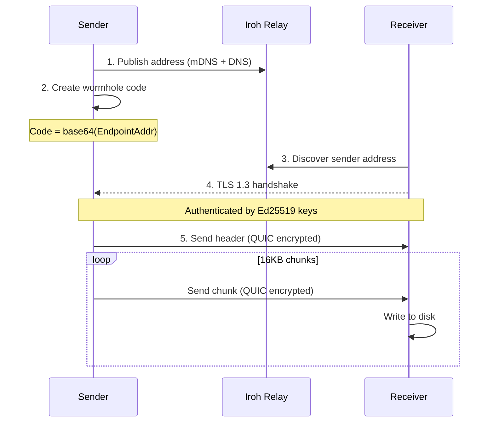
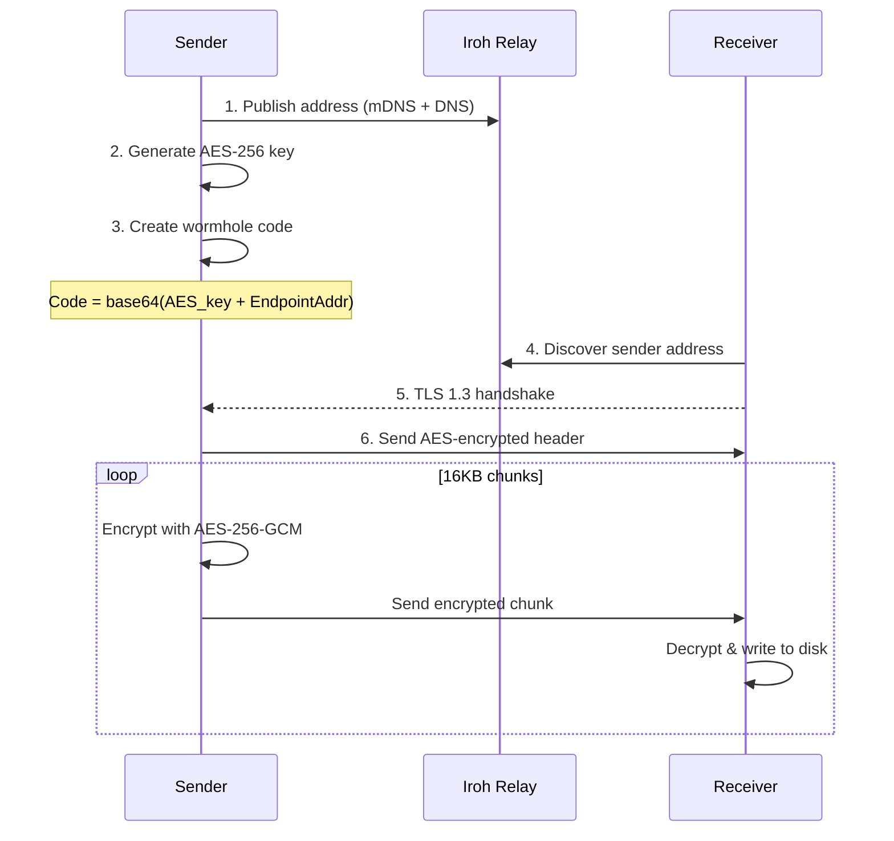
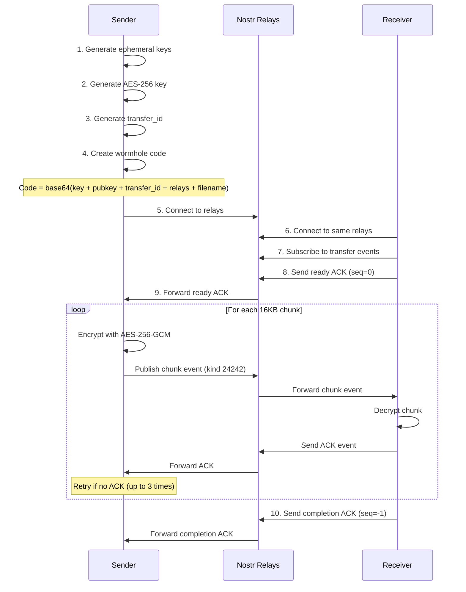
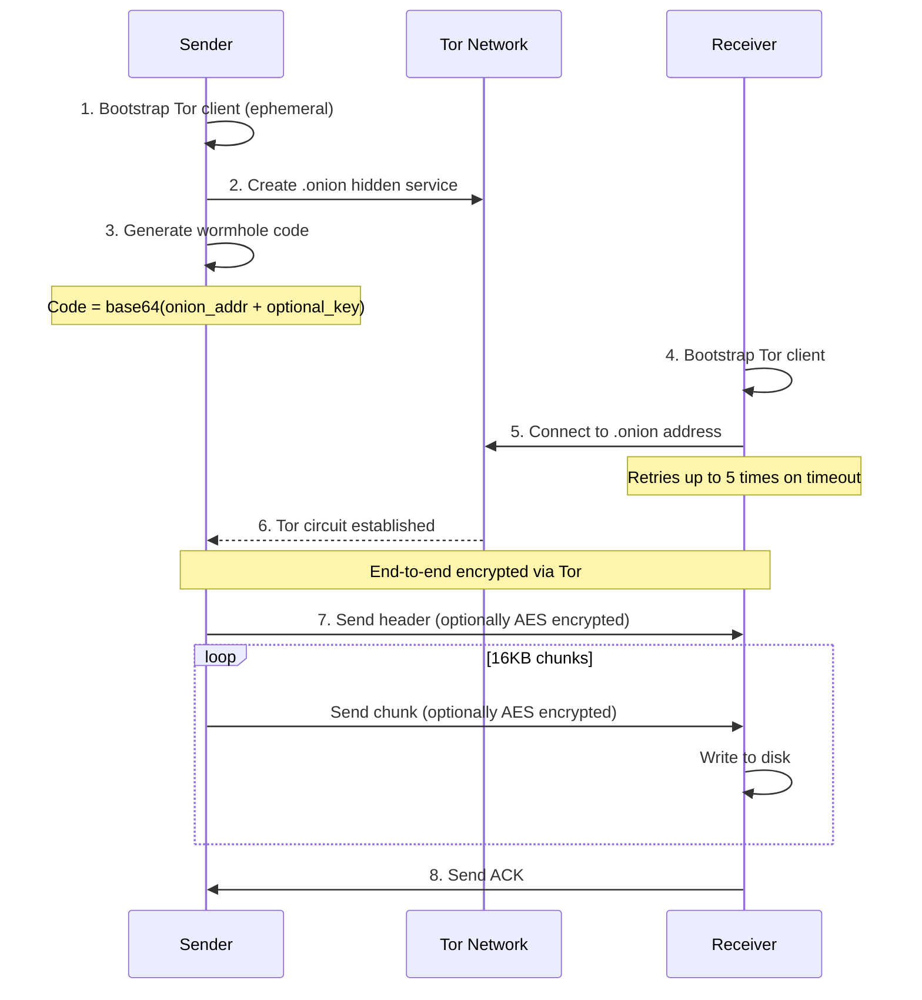

# Wormhole-rs Architecture

## Overview

This document provides a detailed walkthrough of the wormhole-rs implementation.

wormhole-rs supports three transport modes:
- **iroh mode** - Direct P2P transfers using iroh's QUIC/TLS stack (default)
- **Nostr mode** - Small file/folder transfers (≤512KB) via Nostr relays with mandatory encryption
- **Tor mode** - Anonymous transfers via Tor hidden services (.onion addresses) - requires `onion` feature

All modes support both file and folder transfers (folders are sent as tar archives).

## Protocol Flow

### iroh Mode - Default (Relies on iroh's QUIC/TLS)



### iroh Mode - Extra Encryption (`--extra-encrypt`)



### Nostr Mode



### Tor Mode



## Connection Types

### iroh Mode

| Type | Description |
|------|-------------|
| `Direct(addr)` | Direct UDP P2P (fastest, no relay involved) |
| `Relay(url)` | Via relay server (works through strict NAT) |
| `Mixed` | Both available, upgrading to direct |

### Nostr Mode

Nostr mode always uses relays - there is no direct P2P connection. Sender and receiver must connect to at least one common relay.

### Tor Mode

Tor mode uses .onion hidden services. All traffic is routed through the Tor network:
- Sender creates an ephemeral hidden service (new .onion address each transfer)
- Receiver connects via Tor circuit
- Both parties remain anonymous (IP addresses hidden)

## Module Descriptions

### `crypto.rs`
AES-256-GCM encryption/decryption — usage varies by mode:
- `generate_key()` - Creates 256-bit random key (iroh/Tor: only with `--extra-encrypt`; Nostr: always)
- `encrypt_chunk(key, chunk_num, data)` - Encrypts with unique nonce (iroh/Tor: optional; Nostr: mandatory)
- `decrypt_chunk(key, chunk_num, data)` - Decrypts and verifies (iroh/Tor: optional; Nostr: mandatory)

**Mode-specific usage:**
- **iroh mode**: Optional (`--extra-encrypt` flag) — iroh's QUIC/TLS provides baseline encryption
- **Tor mode**: Optional (`--extra-encrypt` flag) — Tor circuits provide baseline encryption
- **Nostr mode**: Mandatory — all chunks are AES-encrypted before publishing to relays

### `wormhole.rs`
Wormhole code generation and parsing (version 2 tokens):

**iroh mode (default):**
```json
{
  "version": 2,
  "protocol": "iroh",
  "extra_encrypt": false,
  "key": null,
  "addr": <EndpointAddr>
}
```

**iroh mode (extra encryption):**
```json
{
  "version": 2,
  "protocol": "iroh",
  "extra_encrypt": true,
  "key": "<base64-encoded-32-bytes>",
  "addr": <EndpointAddr>
}
```

**Nostr mode (file):**
```json
{
  "version": 2,
  "protocol": "nostr",
  "extra_encrypt": true,
  "key": "<base64-encoded-32-bytes>",
  "nostr_sender_pubkey": "<hex>",
  "nostr_transfer_id": "<hex>",
  "nostr_filename": "file.txt",
  "nostr_transfer_type": "file",
  "nostr_use_outbox": true
}
```

**Nostr mode (folder):**
```json
{
  "version": 2,
  "protocol": "nostr",
  "extra_encrypt": true,
  "key": "<base64-encoded-32-bytes>",
  "nostr_sender_pubkey": "<hex>",
  "nostr_transfer_id": "<hex>",
  "nostr_filename": "folder.tar",
  "nostr_transfer_type": "folder",
  "nostr_use_outbox": true
}
```

**Tor mode:**
```json
{
  "version": 2,
  "protocol": "tor",
  "extra_encrypt": false,
  "onion_address": "abc123...xyz.onion"
}
```

**Tor mode (extra encryption):**
```json
{
  "version": 2,
  "protocol": "tor",
  "extra_encrypt": true,
  "key": "<base64-encoded-32-bytes>",
  "onion_address": "abc123...xyz.onion"
}
```

### `transfer.rs`
Wire protocol implementation for iroh mode:

**Default mode:**
- Header: `len(u32) || transfer_type || filename_len || name || size`
- Chunks: `len(u32) || data`

**Extra encryption mode:**
- Encrypted header: `len(u32) || nonce || ciphertext || tag`
- Encrypted chunks: `len(u32) || nonce || ciphertext || tag`

### `folder.rs`
Shared folder handling logic used by all transport modes:
- `create_tar_archive(path)` - Creates tar archive from folder
- `extract_tar_archive(reader, dest)` - Extracts tar to destination
- `StreamingReader` - Async-to-sync adapter for tar extraction
- Handles symlinks, permissions, and security (path traversal prevention)

### `sender_iroh.rs` (iroh mode)
1. Creates iroh Endpoint with N0 + mDNS discovery
2. Optionally generates encryption key (if `--extra-encrypt`)
3. Creates wormhole code and waits for receiver
4. For files: streams header + chunks (optionally encrypted)
5. For folders: creates tar archive, then streams

### `receiver_iroh.rs` (iroh mode)
1. Parses wormhole code to extract address (and key if encrypted)
2. Connects to sender via TLS 1.3 (direct or via relay)
3. Displays connection type (Direct/Relay/Mixed)
4. Receives header to determine transfer type
5. For files: writes data to output file
6. For folders: extracts tar archive to directory

### `nostr_protocol.rs` (Nostr mode)
Nostr protocol implementation:
- Event structures (kind 24242, ephemeral range)
- `create_chunk_event()` - Build chunk event with encrypted data
- `create_ack_event()` - Build ACK event
- `parse_chunk_event()` - Extract chunk data and metadata
- `parse_ack_event()` - Extract ACK sequence number
- `generate_transfer_id()` - Random 16-byte hex ID
- `get_best_relays()` - Fetch from nostr.watch API or use defaults
- Constants: `NOSTR_CHUNK_SIZE = 16KB`, `DEFAULT_NOSTR_RELAYS`

### `nostr_sender.rs` (Nostr mode)
1. Validates file/folder size ≤ 512KB (for folders: tar archive size)
2. For folders: creates tar archive using `folder.rs`
3. Generates ephemeral Nostr keypair
4. Generates AES-256 key (always required)
5. Connects to Nostr relays (from API, custom, or defaults)
6. Generates wormhole code with Nostr metadata (including transfer_type)
7. Waits for receiver ready signal (ACK seq=0)
8. Sends encrypted chunks as Nostr events
9. Waits for ACK after each chunk (30s timeout, 3 retries)
10. Waits for completion ACK (seq=-1)

### `nostr_receiver.rs` (Nostr mode)
1. Parses wormhole code for Nostr metadata
2. Generates ephemeral Nostr keypair
3. Connects to relays (discovers via NIP-65 or uses embedded list)
4. Subscribes to chunk events (filter by transfer_id and sender pubkey)
5. Sends ready ACK (seq=0)
6. Collects chunks into HashMap by sequence number
7. Sends ACK for each received chunk
8. Decrypts chunks with AES-256-GCM
9. Checks `nostr_transfer_type` field
10. For files: writes to output file atomically
11. For folders: extracts tar archive using `folder.rs`
12. Sends completion ACK (seq=-1)

### `onion_sender.rs` (Tor mode, requires `onion` feature)
1. For folders: creates tar archive using `folder.rs`
2. Optionally generates encryption key (if `--extra-encrypt`)
3. Bootstraps ephemeral Tor client (no persistent state)
4. Creates .onion hidden service
5. Generates wormhole code with onion address
6. Waits for receiver to connect via Tor
7. Sends header + chunks (optionally AES encrypted)
8. Waits for ACK

### `onion_receiver.rs` (Tor mode, requires `onion` feature)
1. Parses wormhole code for onion address (and key if encrypted)
2. Bootstraps Tor client
3. Connects to .onion address (retries up to 5 times)
4. Receives header to determine transfer type
5. For files: writes data to output file
6. For folders: extracts tar archive using `folder.rs`
7. Sends ACK

## Security Model

### iroh's Built-in Encryption (Default)

iroh v0.95.1 provides three layers of encryption:

| Layer | Algorithm | Purpose |
|-------|-----------|---------|
| Discovery | ChaCha20-Poly1305 | Encrypts address discovery messages |
| Transport | TLS 1.3 (RFC 7250) | Authenticates connection, derives session keys |
| Stream | QUIC AEAD | Encrypts all packet data |

**Key insight**: The relay server cannot read transferred data because:
1. TLS handshake requires sender's Ed25519 SecretKey (never transmitted)
2. Session keys are derived from handshake (relay doesn't have them)
3. All QUIC packets are encrypted with session keys

### Out-of-Band Code Sharing

The wormhole code is shared manually (copy/paste, voice, etc.):
- Default: Contains only the sender's public address
- Extra encryption: Contains AES key + address

### Why Extra Encryption Exists

The `--extra-encrypt` flag adds AES-256-GCM on top of QUIC/TLS for:
- Defense-in-depth (protects against potential iroh vulnerabilities)
- Future insecure transports (TURN servers, WebRTC)
- Users who want encryption key in the wormhole code

### Nonce Strategy (Extra Encryption Mode)

- Each chunk uses nonce derived from chunk number (counter mode)
- Prevents nonce reuse across chunks
- Receiver verifies nonce matches expected chunk number

### Tor Mode Security

Tor mode provides:

| Property | Description |
|----------|-------------|
| Anonymity | Both sender and receiver IP addresses are hidden |
| End-to-end encryption | Tor circuits provide built-in encryption |
| Ephemeral identity | New .onion address generated per transfer |
| NAT traversal | Works through any firewall |

**Optional extra encryption**: The `--extra-encrypt` flag adds AES-256-GCM on top of Tor's encryption for defense-in-depth.

**Warning**: Tor mode uses Arti (Tor's Rust implementation), which is not yet as secure as C-Tor. Do not use for highly security-sensitive purposes.

## Protocol Compatibility

**Breaking change**: The default mode (no extra encryption) produces different wormhole codes than previous versions. Clients must use matching modes:

| Sender | Receiver | Compatible? |
|--------|----------|-------------|
| Default | Default | Yes |
| `--extra-encrypt` | `--extra-encrypt` | Yes |
| Default | `--extra-encrypt` | No |
| `--extra-encrypt` | Default | No |
