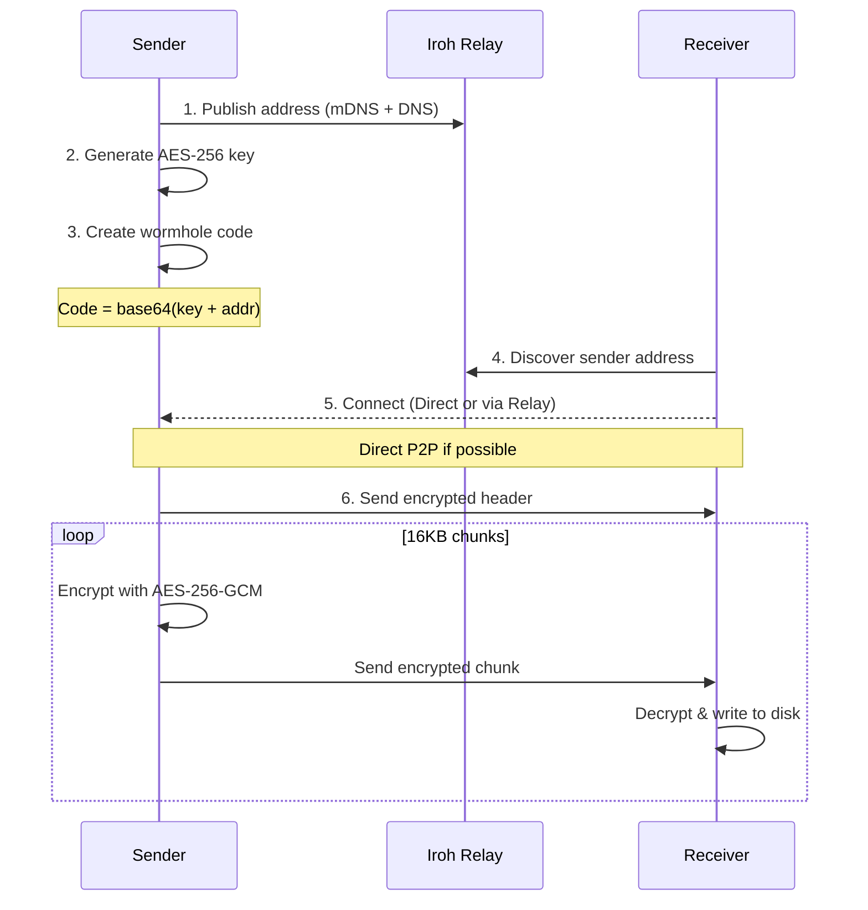

# Wormhole-rs Architecture

## Overview

This document provides a detailed walkthrough of the wormhole-rs implementation.

## Protocol Flow

## Connection Types

| Type | Description |
|------|-------------|
| `Direct(addr)` | Direct UDP P2P (fastest, no relay involved) |
| `Relay(url)` | Via relay server (works through strict NAT) |
| `Mixed` | Both available, upgrading to direct |

## Module Descriptions

### `crypto.rs`
Handles AES-256-GCM encryption with 16KB chunk streaming:
- `generate_key()` - Creates 256-bit random key
- `encrypt_chunk(key, chunk_num, data)` - Encrypts with unique nonce
- `decrypt_chunk(key, chunk_num, data)` - Decrypts and verifies

### `wormhole.rs`
Wormhole code generation:
- Format: `base64(postcard(key + EndpointAddr))`
- Contains: encryption key + iroh EndpointAddr

### `transfer.rs`
Wire protocol implementation:
- Encrypted header: `len(u32) || encrypted(filename_len + name + size)`
- Encrypted chunks: `len(u32) || nonce || ciphertext || tag`

### `sender.rs`
1. Creates iroh Endpoint with N0 + mDNS discovery
2. Generates encryption key and wormhole code
3. Waits for receiver connection
4. Streams encrypted header + chunks

### `receiver.rs`
1. Parses wormhole code to extract key + address
2. Connects to sender (direct or via relay)
3. Displays connection type (Direct/Relay/Mixed)
4. Receives, decrypts, and writes to output file

## Security Model

### Out-of-Band Key Exchange

The encryption key is **never transmitted over the network**:

1. Sender generates a random 32-byte AES-256 key
2. Key is embedded in the wormhole code (base64)
3. User manually shares the code with receiver (copy/paste, voice, etc.)
4. Receiver extracts key from code and decrypts the file

### What the Relay Server Sees

The iroh relay only handles routing - it sees:
- Encrypted chunk data (AES-256-GCM ciphertext)
- Endpoint addresses for routing
- **NOT the encryption key** (only in wormhole code)

### Dual Encryption

| Layer | Algorithm | Purpose |
|-------|-----------|---------|
| Application | AES-256-GCM | End-to-end file encryption |
| Transport | QUIC/TLS | Network encryption |

### Nonce Strategy

- Each chunk uses nonce derived from chunk number (counter mode)
- Prevents nonce reuse across chunks
- Receiver verifies nonce matches expected chunk number
