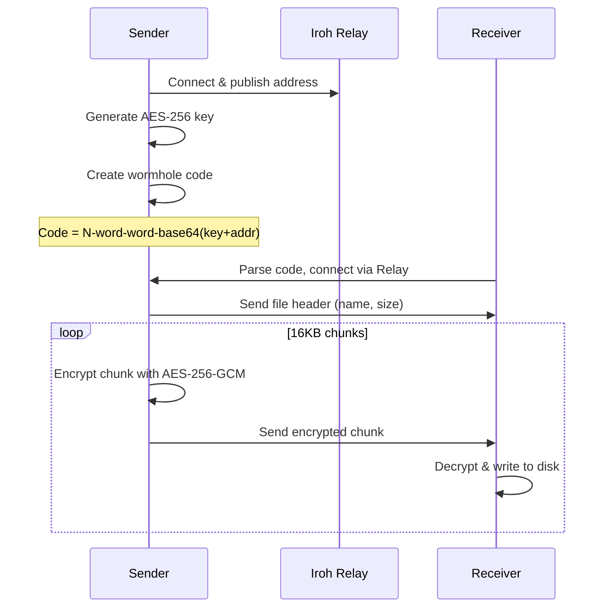

# Wormhole-rs Architecture

## Overview

This document provides a detailed walkthrough of the wormhole-rs implementation.

## Protocol Flow

## Module Descriptions

### `crypto.rs`
Handles AES-256-GCM encryption with 16KB chunk streaming:
- `generate_key()` - Creates 256-bit random key
- `encrypt_chunk(key, chunk_num, data)` - Encrypts with unique nonce
- `decrypt_chunk(key, chunk_num, data)` - Decrypts and verifies

### `wormhole.rs`
Wormhole code generation using human-readable format:
- Format: `N-word-word-base64payload`
- Payload contains: encryption key + iroh EndpointAddr (serialized via postcard)

### `transfer.rs`
Wire protocol implementation:
- Header: `filename_len(u16) || filename || file_size(u64)`
- Chunks: `chunk_len(u32) || encrypted_data`

### `sender.rs`
1. Creates iroh Endpoint with N0 discovery
2. Generates encryption key and wormhole code
3. Waits for receiver connection
4. Streams encrypted chunks

### `receiver.rs`
1. Parses wormhole code to extract key + address
2. Connects to sender via iroh
3. Receives and decrypts chunks
4. Writes to output file

## Security Model

### Out-of-Band Key Exchange

The encryption key is **never transmitted over the network**:

1. Sender generates a random 32-byte AES-256 key
2. Key is embedded in the wormhole code (base64)
3. User manually shares the code with receiver (copy/paste, voice, etc.)
4. Receiver extracts key from code and decrypts the file

### What the Relay Server Sees

The iroh relay only handles routing - it sees:
- Encrypted chunk data (AES-256-GCM ciphertext)
- Endpoint addresses for routing
- **NOT the encryption key** (only in wormhole code)

### Dual Encryption

| Layer | Algorithm | Purpose |
|-------|-----------|---------|
| Application | AES-256-GCM | End-to-end file encryption |
| Transport | QUIC/TLS | Network encryption |

### Nonce Strategy

- Each chunk uses nonce derived from chunk number (counter mode)
- Prevents nonce reuse across chunks
- Receiver verifies nonce matches expected chunk number
