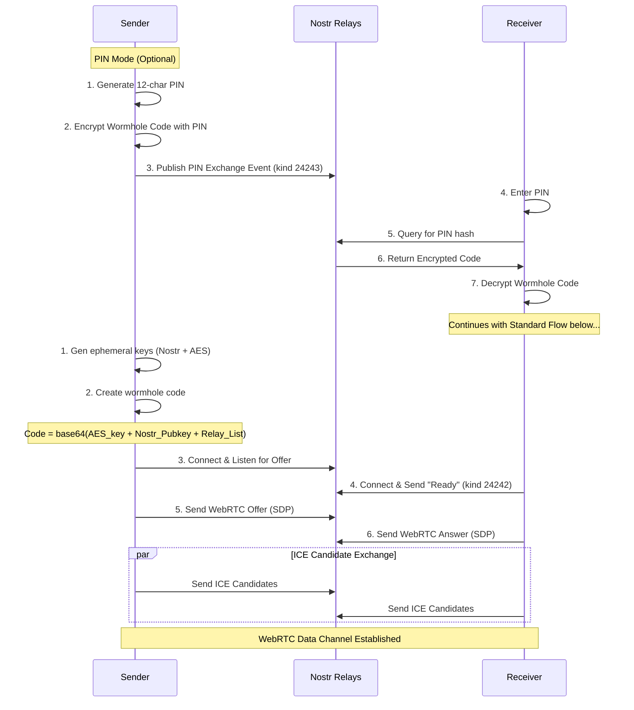
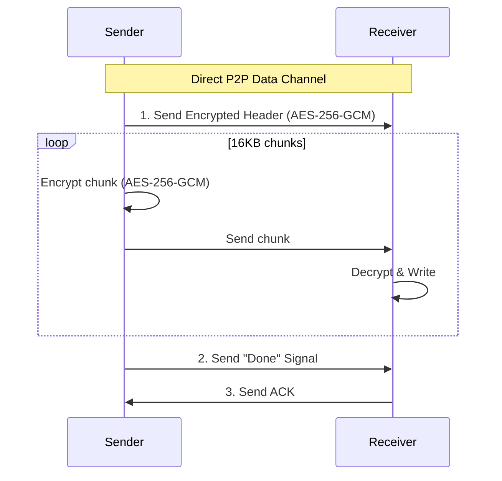
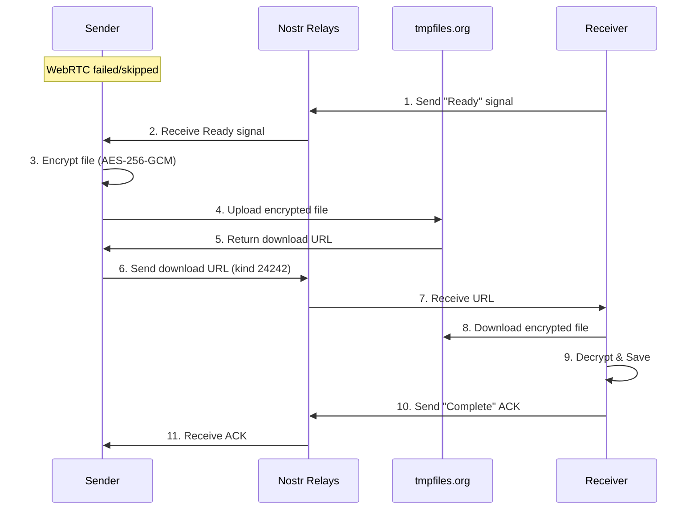
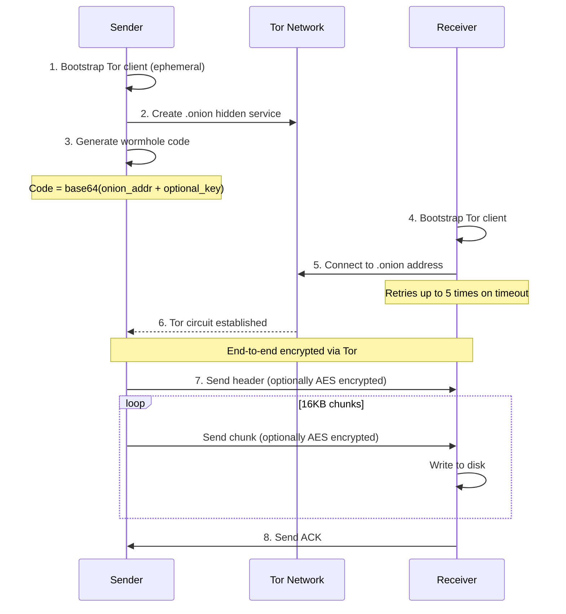
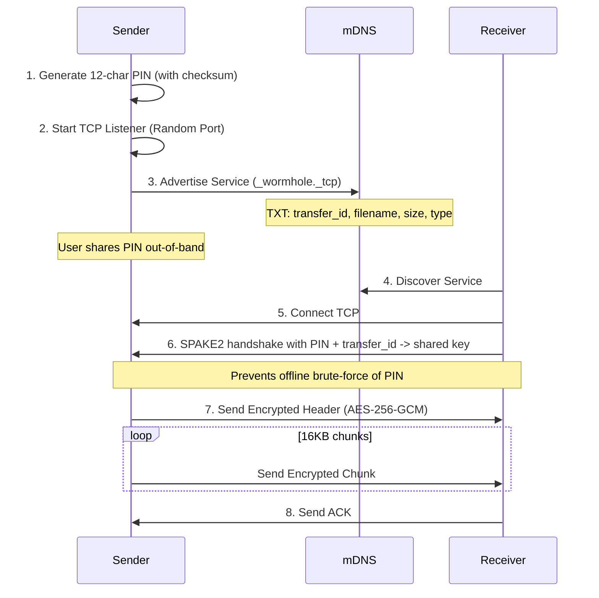

# Wormhole-rs Architecture

## Overview

This document provides a detailed walkthrough of the wormhole-rs implementation.

wormhole-rs supports two main categories of transport:

1. **Internet Transfers** (using `wormhole-rs send`):
    - **iroh mode** - Direct P2P transfers using iroh's QUIC/TLS stack (automatic relay fallback)
    - **WebRTC Mode**: WebRTC with Nostr signaling by default, optional copy/paste manual signaling (`--manual-signaling`), and tmpfiles.org relay fallback when P2P fails or `--force-relay` is set
    - **Tor Mode**: For anonymity (uses `arti` to create hidden services)
2. **Local Transfers** (using `wormhole-rs send-local`):
    - **mDNS Mode**: LAN-only transfers using mDNS discovery + TCP with SPAKE2 key exchange driven by a 12-character PIN

## Transfer Flows

### 1. Internet Transfers (Wormhole Code)

#### WebRTC Mode

**1. Signaling (WebRTC + Nostr)**

**2. Data Transfer (WebRTC Path)**

**3. Fallback Path (tmpfiles.org)**

If WebRTC fails or `--force-relay` is used:

#### Manual Signaling (Copy/Paste, Offline-Friendly)

Used when relays are blocked or unavailable (`--manual-signaling`). Signaling blobs are base64url-encoded JSON with CRC32 checksums; they expire under the same TTL checks as wormhole codes.

1. Sender gathers ICE candidates (STUN only) and prints an offer blob containing SDP, ICE candidates, filename/size/type, and a hex AES-256-GCM key.
2. Receiver pastes the blob, validates checksum/TTL, sets the remote description, and returns an answer blob with SDP + ICE.
3. Sender pastes the answer, completes WebRTC setup, and transfers over the encrypted data channel. Fallback to tmpfiles.org remains available if `--force-relay` is provided.

#### Tor Mode

### 2. Local Transfers (LAN)

#### Local Mode (mDNS + TCP)

Local mode is designed for transfers on the same LAN without internet access. It uses a SPAKE2 PAKE to derive the session key from a short PIN, preventing offline dictionary attacks.

## Connection Types/Modes

### iroh Mode (`wormhole-rs send iroh`)
- **Transport**: QUIC / TLS 1.3
- **Discovery**: iroh's global discovery + mDNS
- **Relay**: iroh managed relays (derp) - automatically used if direct P2P connection fails
- **Encryption**: Always authenticated/encrypted by QUIC. Optional extra AES layer.

### WebRTC Mode (`wormhole-rs send webrtc`)
- **Transport**: WebRTC Data Channels (SCTP/DTLS)
- **Signaling**: Nostr Relays (JSON payloads) by default; copy/paste manual signaling available with `--manual-signaling`
- **Fallback**: tmpfiles.org (100MB limit, 60 min retention)
- **NAT traversal**: STUN (no built-in TURN); fallback relay path available via tmpfiles.org
- **Encryption**: Mandatory AES-256-GCM for all application data (on top of DTLS).

### Local Mode (`wormhole-rs send-local`)
- **Transport**: Raw TCP
- **Discovery**: mDNS (Multicast DNS)
- **Key Exchange**: SPAKE2 using a 12-character PIN + transfer_id (prevents offline dictionary attacks)
- **Encryption**: Mandatory AES-256-GCM using SPAKE2-derived key
- **Port**: Random ephemeral port

### Tor Mode (`wormhole-rs send tor`)
- **Transport**: Tor Onion Services
- **Discovery**: Onion Address
- **Encryption**: Tor Circuit encryption + Optional extra AES.

## Security Model

### iroh's Built-in Encryption (Default)
Relies on TLS 1.3/QUIC. Key exchange happens via the `EndpointAddr` (embedded in wormhole code).
- **Confidentiality**: Strong (ChaCha20-Poly1305).
- **Authentication**: Mutual (Ed25519 keys).

### WebRTC Mode Encryption (WebRTC + Nostr)
Since signaling happens over public relays, we cannot trust the transport for key exchange.
- **Key Exchange**: Ephemeral AES-256 key generated by sender, carried in the wormhole code (Nostr signaling) or inside the manual-offer blob (`--manual-signaling`).
- **Confidentiality**: All Header/Chunk data is encrypted with AES-256-GCM BEFORE sending to WebRTC or Relay.
- **Signaling Privacy**: Metadata (SDP, ICE) is currently sent in plaintext JSON events (Kinds 24242). This reveals IP addresses to relays but NOT file contents. Manual signaling uses copy/paste blobs without relays.

### PIN-based Key Exchange
- **Format**: 12 characters (11 random + 1 checksum) from an unambiguous charset; the checksum catches typos before attempting a connection.
- **Nostr PIN exchange (`--pin`)**: Wormhole code is encrypted with AES-256-GCM using a key derived from the PIN via Argon2id (3 passes, 64MB RAM, parallelism 4). The salt + PIN hint are in the event tags (kind 24243) with a 1-hour expiration. Relays only see ciphertext.
- **Local mDNS**: The same PIN is fed into SPAKE2 (with transfer_id as context) to derive the session key; no salts are advertised in mDNS TXT records.
- **Security**: Argon2id slows online guessing of PIN-protected codes; SPAKE2 prevents offline dictionary attacks for LAN mode and rejects wrong transfer_id.

### Local Mode Encryption
- **Key Exchange**: SPAKE2 PAKE using the user-shared PIN and transfer_id.
- **Confidentiality**: All headers and 16KB chunks over TCP are AES-256-GCM encrypted with the SPAKE2-derived key.

### Tor Mode Security
- **Anonymity**: Sender/Receiver IPs hidden.
- **Encryption**: End-to-end via Tor.

### TTL (Time-To-Live) Validation

All wormhole codes and signaling offers include a creation timestamp and are validated against a TTL to prevent replay attacks and stale session establishment.

**Implementation:**
- **Token Version**: v3+ tokens include a `created_at` Unix timestamp
- **TTL Duration**: 30 minutes (`CODE_TTL_SECS = 1800`)
- **Clock Skew**: Allows up to 60 seconds into the future to handle minor clock drift

**Validation Points:**
1. **Wormhole Codes** (iroh/tor/webrtc via Nostr): Validated in `parse_code()` before connection
2. **Manual Signaling Offers** (`--manual-signaling` WebRTC): Validated in `read_offer_json()` before WebRTC handshake

**Not used for mDNS (Local Mode):**
TTL validation is not applied to local mDNS transfers because it is unnecessary:
- The mDNS service advertisement is ephemeral and disappears when the sender exits
- There is no persistent code/token that could be stored and replayed later
- The connection happens immediately over direct TCP on the LAN

**Error Messages:**
- Expired codes: "Token expired: code is X minutes old (max 30 minutes). Please request a new code from the sender."
- Future timestamps: "Invalid token: created_at is in the future. Check system clock."

