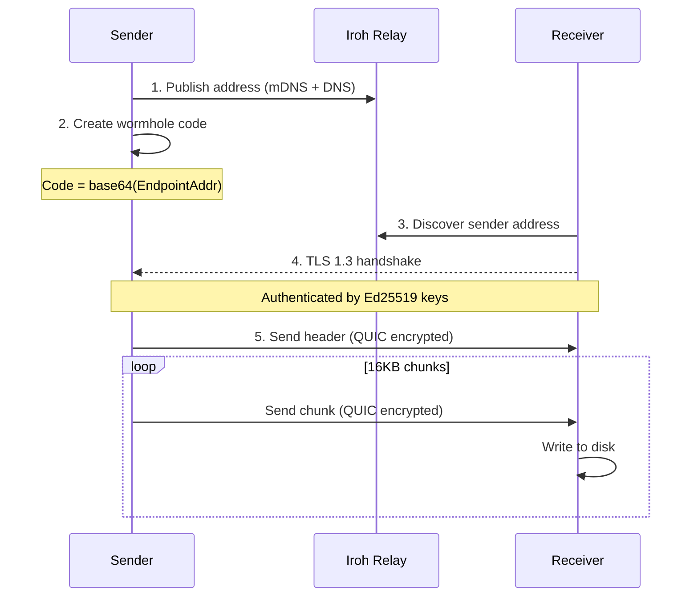
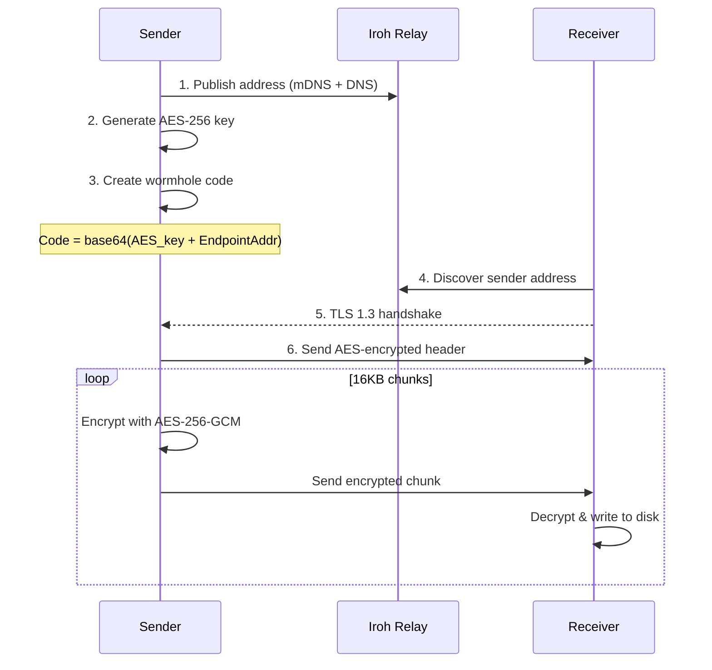
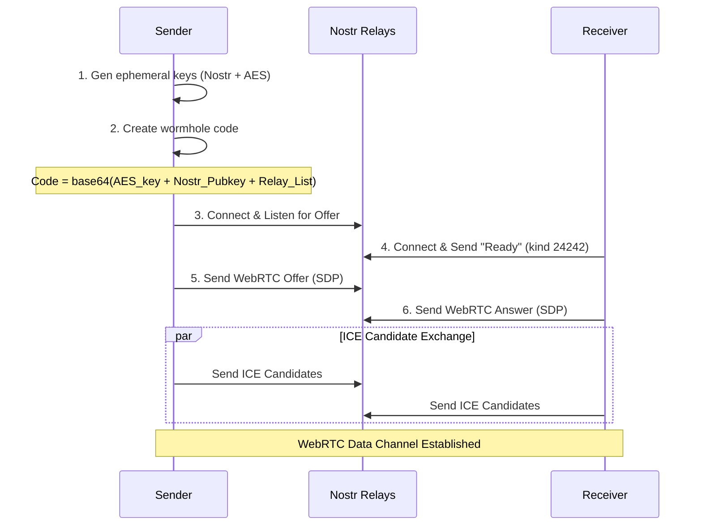
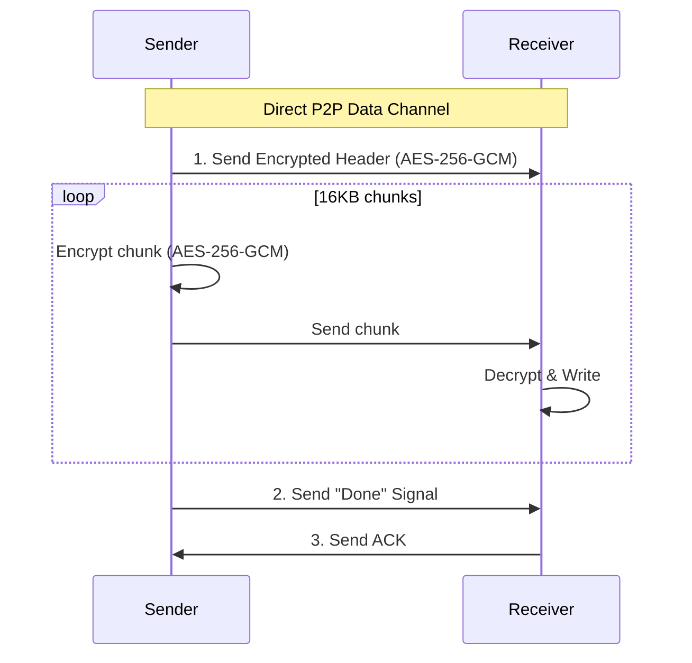
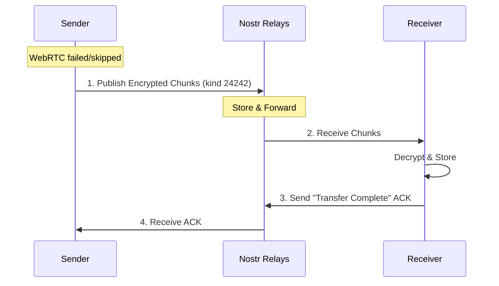
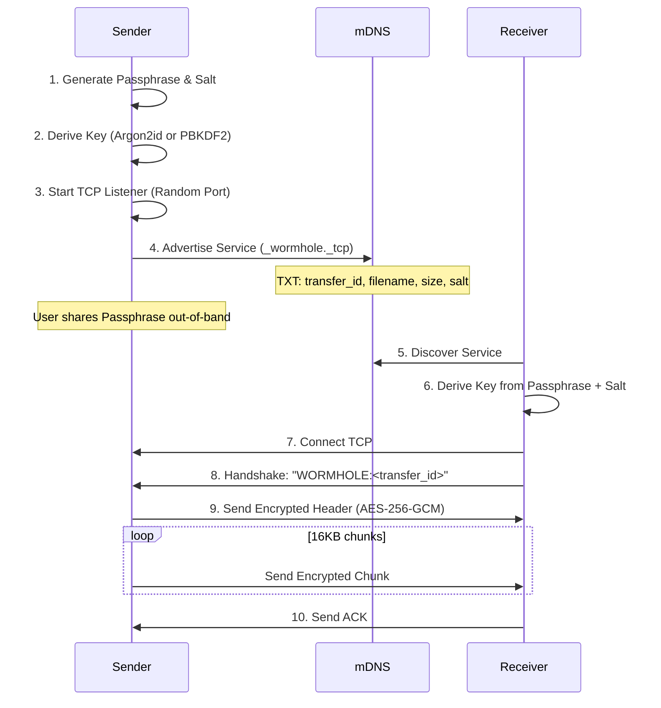
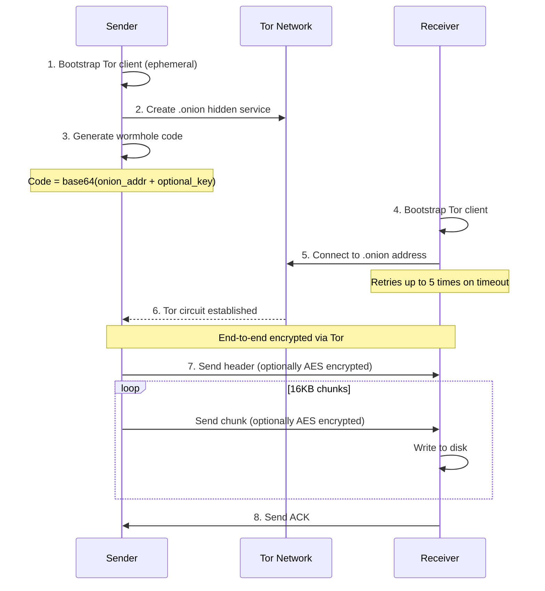

# Wormhole-rs Architecture

## Overview

This document provides a detailed walkthrough of the wormhole-rs implementation.

wormhole-rs supports four transport modes:
- **iroh mode** - Direct P2P transfers using iroh's QUIC/TLS stack (automatic relay fallback)
- **Hybrid mode** - WebRTC P2P with Nostr signaling + relay fallback (browser-compatible)
- **Tor mode** - Anonymous transfers via Tor hidden services (.onion addresses) - requires `onion` feature
- **Local mode** - LAN transfers using mDNS for discovery and TCP for transport

## Protocol Flow

### iroh Mode - Default (Relies on iroh's QUIC/TLS)



### iroh Mode - Extra Encryption (`--extra-encrypt`)



### Hybrid Mode (WebRTC + Nostr)

Hybrid mode uses Nostr relays for signaling to establish a direct WebRTC connection. If WebRTC fails, it falls back to transferring the file directly through Nostr relays (encrypted).

#### 1. Signaling & WebRTC Setup



#### 2. Data Transfer (WebRTC Path)



#### 3. Fallback Path (Nostr Relay)

If WebRTC fails or `--force-nostr-relay` is used:



### Local Mode (mDNS + TCP)

Local mode is designed for transfers on the same LAN without internet access. It uses a different security model based on a shared passphrase.



### Tor Mode



## Connection Types/Modes

### iroh Mode (`wormhole-rs send iroh`)
- **Transport**: QUIC / TLS 1.3
- **Discovery**: iroh's global discovery + mDNS
- **Relay**: iroh managed relays (derp) - automatically used if direct P2P connection fails
- **Encryption**: Always authenticated/encrypted by QUIC. Optional extra AES layer.

### Hybrid Mode (`wormhole-rs send hybrid`)
- **Transport**: WebRTC Data Channels (SCTP/DTLS)
- **Signaling**: Nostr Relays (JSON payloads)
- **Fallback**: Nostr Relays (Store-and-forward)
- **Encryption**: Mandatory AES-256-GCM for all application data (on top of DTLS).

### Local Mode (`wormhole-rs send-local`)
- **Transport**: Raw TCP
- **Discovery**: mDNS (Multicast DNS)
- **Encryption**: Mandatory AES-256-GCM with key derived from ephemeral passphrase.
- **Port**: Random ephemeral port

### Tor Mode (`wormhole-rs send tor`)
- **Transport**: Tor Onion Services
- **Discovery**: Onion Address
- **Encryption**: Tor Circuit encryption + Optional extra AES.

## Module Descriptions

### `crypto.rs`
AES-256-GCM encryption/decryption.
- `generate_key()` - Creates 256-bit random key
- `encrypt_chunk(key, chunk_num, data)` - Encrypts with unique nonce derived from chunk number.
- `decrypt_chunk(key, chunk_num, data)` - Decrypts and verifies.

### `wormhole.rs`
Wormhole code generation and parsing (version 2 tokens). Different modes produce different JSON structures in the base64 token.

### `folder.rs`
Shared folder handling logic:
- `create_tar_archive(path)` - Creates tar archive
- `extract_tar_archive(reader, dest)` - Extracts tar
- Handles symlinks and security (path traversal prevention).

### `sender/receiver_iroh.rs`
Implements the iroh-based transport logic.

### `mdns_sender/receiver.rs`
Implements the Local LAN transport logic (mDNS advertisement + TCP listener).

### `hybrid_sender/receiver.rs`
Implements the Hybrid transport logic:
- Orchestrates the WebRTC connection.
- Manages Nostr signaling.
- Handles fallback to `nostr_sender/receiver` if WebRTC fails.

### `nostr_signaling.rs` & `webrtc_common.rs`
Helpers for the Hybrid mode:
- `nostr_signaling.rs`: Handles publishing/subscribing to Nostr events for SDP/ICE exchange.
- `webrtc_common.rs`: Wraps the `webrtc` crate to provide a simpler API for data channels.

### `onion_sender/receiver.rs`
Implements the Tor transport logic using `arti`.

## Security Model

### iroh's Built-in Encryption (Default)
Relies on TLS 1.3/QUIC. Key exchange happens via the `EndpointAddr` (embedded in wormhole code).
- **Confidentiality**: Strong (ChaCha20-Poly1305).
- **Authentication**: Mutual (Ed25519 keys).

### Hybrid Mode Encryption (WebRTC + Nostr)
Since signaling happens over public relays, we cannot trust the transport for key exchange.
- **Key Exchange**: Ephemeral AES-256 key generated by sender, put in Wormhole Code.
- **Confidentiality**: All Header/Chunk data is encrypted with AES-256-GCM BEFORE sending to WebRTC or Relay.
- **Signaling Privacy**: Metadata (SDP, ICE) is currently sent in plaintext JSON events (Kinds 24242). This reveals IP addresses to relays but NOT file contents.

### Local Mode Encryption
- **Key Exchange**: Passphrase displayed to user.
- **Derivation**: Key = KDF(Passphrase, Salt).
- **Confidentiality**: All data over TCP is AES-256-GCM encrypted.

### Tor Mode Security
- **Anonymity**: Sender/Receiver IPs hidden.
- **Encryption**: End-to-end via Tor.

## Protocol Compatibility

**Breaking changes in v0.2.0**:
- Introduction of explicit subcommands (`iroh`, `hybrid`, `tor`).
- Wormhole codes for different protocols are distinct and not interchangeable.
- Hybrid mode replaces the old "Nostr Mode" and "WebRTC Mode" separation.

## Project Structure

```
src/
├── main.rs              # CLI entry point (subcommands)
├── lib.rs               # Library exports
├── crypto.rs            # AES-256-GCM
├── wormhole.rs          # Code generation/parsing
├── compression.rs       # (If applicable)
├── folder.rs            # Tar archive logic
├── transfer.rs          # Common wire protocol elements
├── iroh_common.rs       # Iroh setup
├── sender_iroh.rs       # Iroh Sender
├── receiver_iroh.rs     # Iroh Receiver
├── mdns_common.rs       # mDNS constants/helpers
├── mdns_sender.rs       # Local Mode Sender
├── mdns_receiver.rs     # Local Mode Receiver
├── hybrid_sender.rs     # Hybrid Sender (WebRTC+Nostr)
├── hybrid_receiver.rs   # Hybrid Receiver
├── nostr_signaling.rs   # Signaling logic
├── webrtc_common.rs     # WebRTC helpers
└── [onion modules]      # Tor support
```

## Dependencies

- `iroh`: P2P networking
- `webrtc`: WebRTC implementation
- `nostr-sdk`: Nostr protocol
- `mdns-sd`: Local discovery
- `aes-gcm`: Encryption
- `arti`: Tor client (optional)
- `tokio`: Async runtime
- `clap`: CLI parsing
