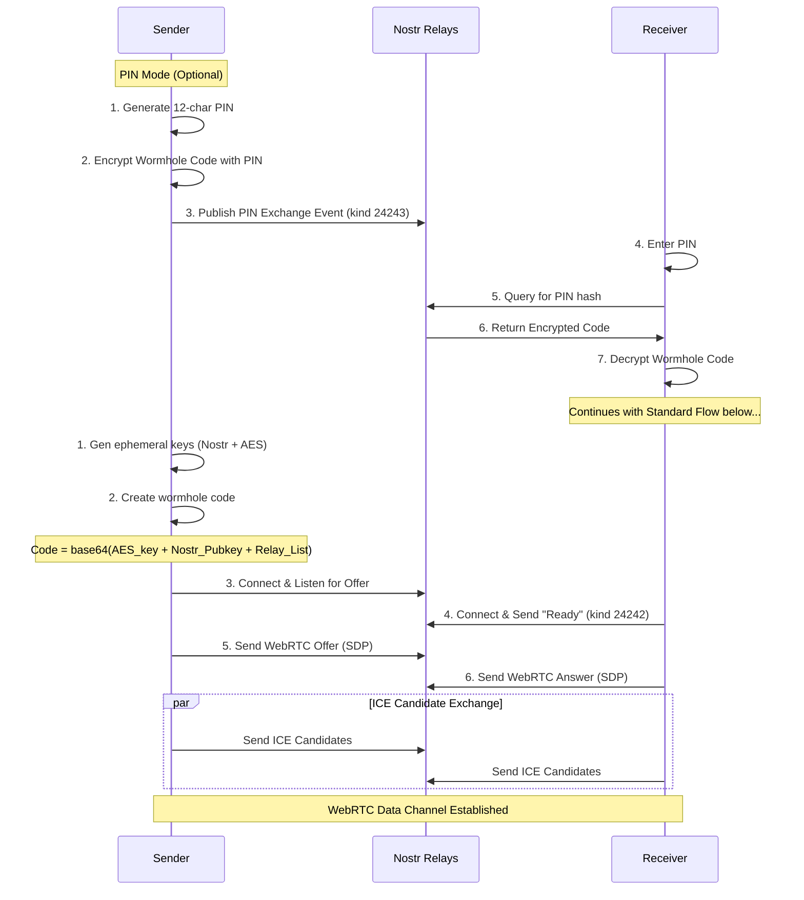
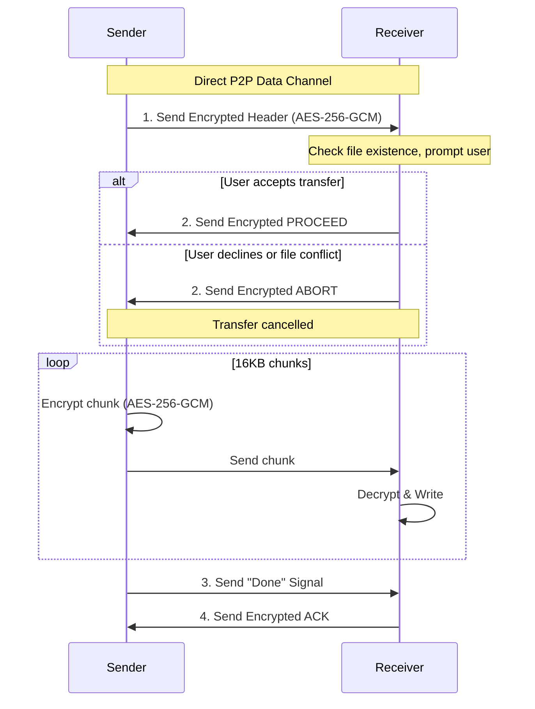
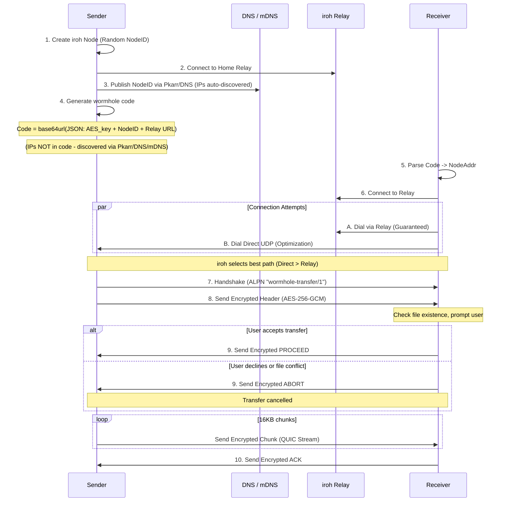
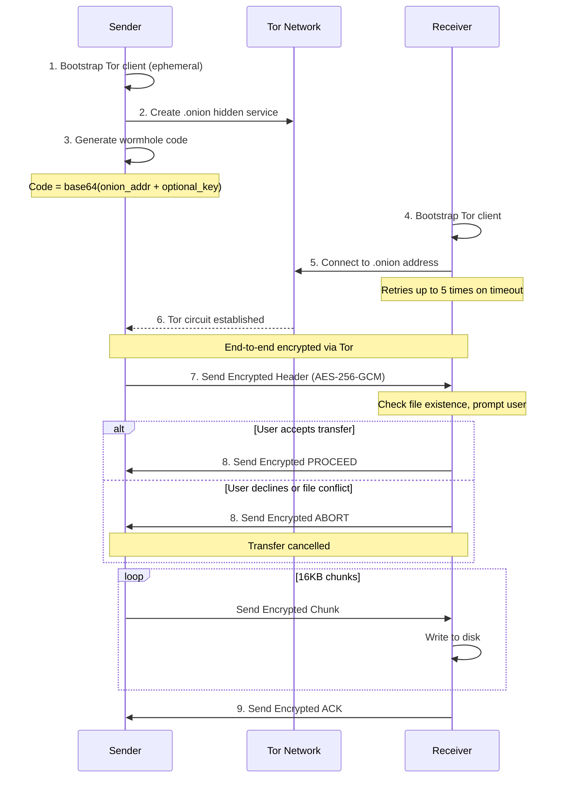
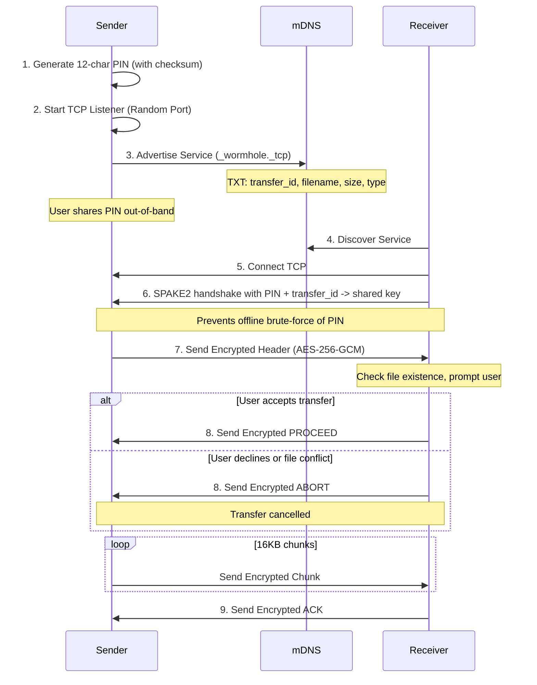

# Wormhole-rs Architecture

## Overview

This document provides a detailed walkthrough of the wormhole-rs implementation.

wormhole-rs supports two main categories of transport:

1. **Internet Transfers** (using `wormhole-rs send`):
    - **WebRTC Mode** (Recommended): WebRTC with Nostr signaling by default, optional copy/paste manual signaling (`--manual-signaling`)
    - **iroh mode** - Direct P2P transfers using iroh's QUIC/TLS stack (automatic relay fallback)
    - **Tor Mode**: For anonymity and relay when direct P2P fails (uses `arti` to create hidden services)
2. **Local Transfers** (using `wormhole-rs send-local`):
    - **mDNS Mode**: LAN-only transfers using mDNS discovery + TCP with SPAKE2 key exchange driven by a 12-character PIN

## Transfer Flows

### 1. Internet Transfers (Wormhole Code)

#### WebRTC Mode

**1. Signaling (WebRTC + Nostr)**



**2. Data Transfer (WebRTC Path)**



#### iroh Mode (QUIC / Direct + Relay)

iroh uses a "hole punching" strategy that attempts direct connections via UDP/QUIC while simultaneously establishing a fallback path through a Relay (DERP) server.



#### Manual Signaling (Copy/Paste, Offline-Friendly)

Used when relays are blocked or unavailable (`--manual-signaling`). Signaling blobs are base64url-encoded JSON with CRC32 checksums; they expire under the same TTL checks as wormhole codes.

1. Sender gathers ICE candidates (STUN only) and prints an offer blob containing SDP, ICE candidates, filename/size/type, and a hex AES-256-GCM key.
2. Receiver pastes the blob, validates checksum/TTL, sets the remote description, and returns an answer blob with SDP + ICE.
3. Sender pastes the answer, completes WebRTC setup, and transfers over the encrypted data channel.

#### Tor Mode



### 2. Local Transfers (LAN)

#### Local Mode (mDNS + TCP)

Local mode is designed for transfers on the same LAN without internet access. It uses a SPAKE2 PAKE to derive the session key from a short PIN, preventing offline dictionary attacks.



## Connection Types/Modes

### WebRTC Mode (`wormhole-rs send` / `send-webrtc`) - Recommended
- **Why Recommended**: Most mature and reliable; works well for both small and large files; has manual signaling fallback (`--manual-signaling`) for direct P2P when Nostr relays are unavailable
- **Transport**: WebRTC Data Channels (SCTP/DTLS)
- **Signaling**: Nostr Relays (JSON payloads) by default; copy/paste manual signaling available with `--manual-signaling`
  - Default: Auto-discovers best relays via NIP-65/NIP-66, probes for capability and latency
  - Custom: Use `--nostr-relay wss://...` for specific Nostr relays
  - Fallback: Use `--use-default-relays` to skip discovery and use hardcoded defaults
- **NAT traversal**: STUN (no built-in TURN); if direct P2P fails, use Tor mode for relay
- **Encryption**: Mandatory AES-256-GCM for all application data (on top of DTLS).

### iroh Mode (`wormhole-rs send-iroh`)
- **Transport**: QUIC / TLS 1.3
- **Discovery**: iroh's global discovery (n0 DNS / pkarr) + mDNS for local network.
- **Relay**: iroh relays (DERP) - automatically used if direct P2P connection fails.
- **Failover**: Uses multiple relays for redundancy; monitors latency to select the best path.
- **Connection**: "Hole punching" attempts to establish a direct UDP connection; falls back to relay if NATs are strict.
- **Protocol**: ALPN `wormhole-transfer/1`.
- **Encryption**: Always AES-256-GCM encrypted at the application layer, plus QUIC/TLS encryption.

### Local Mode (`wormhole-rs send-local`)
- **Transport**: Raw TCP
- **Discovery**: mDNS (Multicast DNS)
- **Key Exchange**: SPAKE2 using a 12-character PIN + transfer_id (prevents offline dictionary attacks)
- **Encryption**: Mandatory AES-256-GCM using SPAKE2-derived key
- **Port**: Random ephemeral port

### Tor Mode (`wormhole-rs send-tor`)
- **Transport**: Tor Onion Services
- **Discovery**: Onion Address
- **Encryption**: Tor circuit encryption plus mandatory AES-256-GCM at the application layer.


## Security Model

### iroh Mode Encryption (Dual Layer)
iroh mode uses two encryption layers for defense in depth:

**Transport Layer (iroh/QUIC)**:
- TLS 1.3/QUIC encryption (ChaCha20-Poly1305)
- Key exchange via NodeID (Ed25519 public key in wormhole code)
- Mutual authentication between peers

**Application Layer (wormhole-rs)**:
- AES-256-GCM encryption for all data: headers, chunks, and control signals
- 256-bit key generated per transfer, embedded in wormhole code
- Nonce derived from chunk number (prevents replay attacks)
- Control signals (PROCEED, ABORT, ACK) are encrypted using reserved chunk numbers

### WebRTC Mode Encryption (WebRTC + Nostr)
Since signaling happens over public relays, we cannot trust the transport for key exchange.
- **Key Exchange**: Ephemeral AES-256 key generated by sender, carried in the wormhole code (Nostr signaling) or inside the manual-offer blob (`--manual-signaling`).
- **Confidentiality**: All data (headers, chunks, and control signals) is encrypted with AES-256-GCM BEFORE sending over the data channel.
- **Signaling Privacy**: Metadata (SDP, ICE) is currently sent in plaintext JSON events (Kinds 24242). This reveals IP addresses to relays but NOT file contents. Manual signaling uses copy/paste blobs without relays.

### PIN-based Key Exchange
- **Format**: 12 characters (11 random + 1 checksum) from an unambiguous charset; the checksum catches typos before attempting a connection.
- **Nostr PIN exchange (`--pin`)**: Wormhole code is encrypted with AES-256-GCM using a key derived from the PIN via Argon2id (3 passes, 64MB RAM, parallelism 4). The salt + PIN hint are in the event tags (kind 24243) with a 1-hour expiration. Relays only see ciphertext.
- **Local mDNS**: The same PIN is fed into SPAKE2 (with transfer_id as context) to derive the session key; no salts are advertised in mDNS TXT records.
- **Security**: Argon2id slows online guessing of PIN-protected codes; SPAKE2 prevents offline dictionary attacks for LAN mode and rejects wrong transfer_id.

### Local Mode Encryption
- **Key Exchange**: SPAKE2 PAKE using the user-shared PIN and transfer_id.
- **Confidentiality**: All data (headers, chunks, and control signals) over TCP is AES-256-GCM encrypted with the SPAKE2-derived key.

### Tor Mode Security
- **Anonymity**: Sender/Receiver IPs hidden.
- **Encryption**: End-to-end via Tor circuit encryption plus mandatory AES-256-GCM at application layer for all data (headers, chunks, and control signals).

### TTL (Time-To-Live) Validation

All wormhole codes and signaling offers include a creation timestamp and are validated against a TTL to prevent replay attacks and stale session establishment.

**Implementation:**
- **Token Version**: v3+ tokens include a `created_at` Unix timestamp
- **TTL Duration**: 30 minutes (`CODE_TTL_SECS = 1800`)
- **Clock Skew**: Allows up to 60 seconds into the future to handle minor clock drift

**Validation Points:**
1. **Wormhole Codes** (iroh/tor/webrtc via Nostr): Validated in `parse_code()` before connection
2. **Manual Signaling Offers** (`--manual-signaling` WebRTC): Validated in `read_offer_json()` before WebRTC handshake

**Not used for mDNS (Local Mode):**
TTL validation is not applied to local mDNS transfers because it is unnecessary:
- The mDNS service advertisement is ephemeral and disappears when the sender exits
- There is no persistent code/token that could be stored and replayed later
- The connection happens immediately over direct TCP on the LAN

**Error Messages:**
- Expired codes: "Token expired: code is X minutes old (max 30 minutes). Please request a new code from the sender."
- Future timestamps: "Invalid token: created_at is in the future. Check system clock."

## Wire Protocol Format

### Encrypted Message Format (Stream-based transports)

All encrypted messages (used by Iroh, Tor, and mDNS modes) follow this format:

```
[length: 4 bytes BE][nonce: 12 bytes][ciphertext][tag: 16 bytes]
```

- **length**: Big-endian u32 indicating total size of encrypted payload (nonce + ciphertext + tag)
- **nonce**: 12-byte AES-GCM nonce derived from chunk number
- **ciphertext**: Encrypted data
- **tag**: 16-byte AES-GCM authentication tag

### Chunk Numbers and Control Signals

Each encrypted message uses a chunk number to derive a unique nonce:

| Message Type | Chunk Number | Plaintext Content |
|-------------|--------------|-------------------|
| Header | 0 | File metadata (type, name, size) |
| Data Chunk 1 | 1 | First 16KB of file data |
| Data Chunk N | N | Nth chunk of file data |
| PROCEED | `u64::MAX` | `b"PROCEED"` |
| ABORT | `u64::MAX - 1` | `b"ABORT"` |
| ACK | `u64::MAX - 2` | `b"ACK"` |

Using reserved high chunk numbers for control signals ensures:
- Same encryption infrastructure for all messages
- No collision with data chunk numbers
- Full end-to-end encryption of the transfer protocol

### WebRTC Message Format

WebRTC uses a message-based protocol with a type byte prefix:

```
[type: 1 byte][length: 4 bytes BE][encrypted_payload]
```

| Type Byte | Message |
|-----------|---------|
| 0 | Header |
| 1 | Data Chunk |
| 2 | Done Signal |
| 3 | ACK (encrypted) |
| 4 | PROCEED (encrypted) |
| 5 | ABORT (encrypted) |

The encrypted payload for control signals (types 3, 4, 5) uses the same AES-256-GCM encryption with reserved chunk numbers as stream-based transports.

### Confirmation Handshake

Before data transfer begins, the receiver validates the incoming transfer:

1. **Sender** sends encrypted file header containing filename, size, and transfer type
2. **Receiver** checks:
   - If file already exists at destination
   - If user wants to proceed (interactive prompt)
3. **Receiver** responds with:
   - **PROCEED**: Accept transfer, sender begins sending data chunks
   - **ABORT**: Decline transfer, connection is closed

This handshake prevents:
- Accidental file overwrites without user consent
- Wasted bandwidth on declined transfers
- Sender continuing after receiver has disconnected

