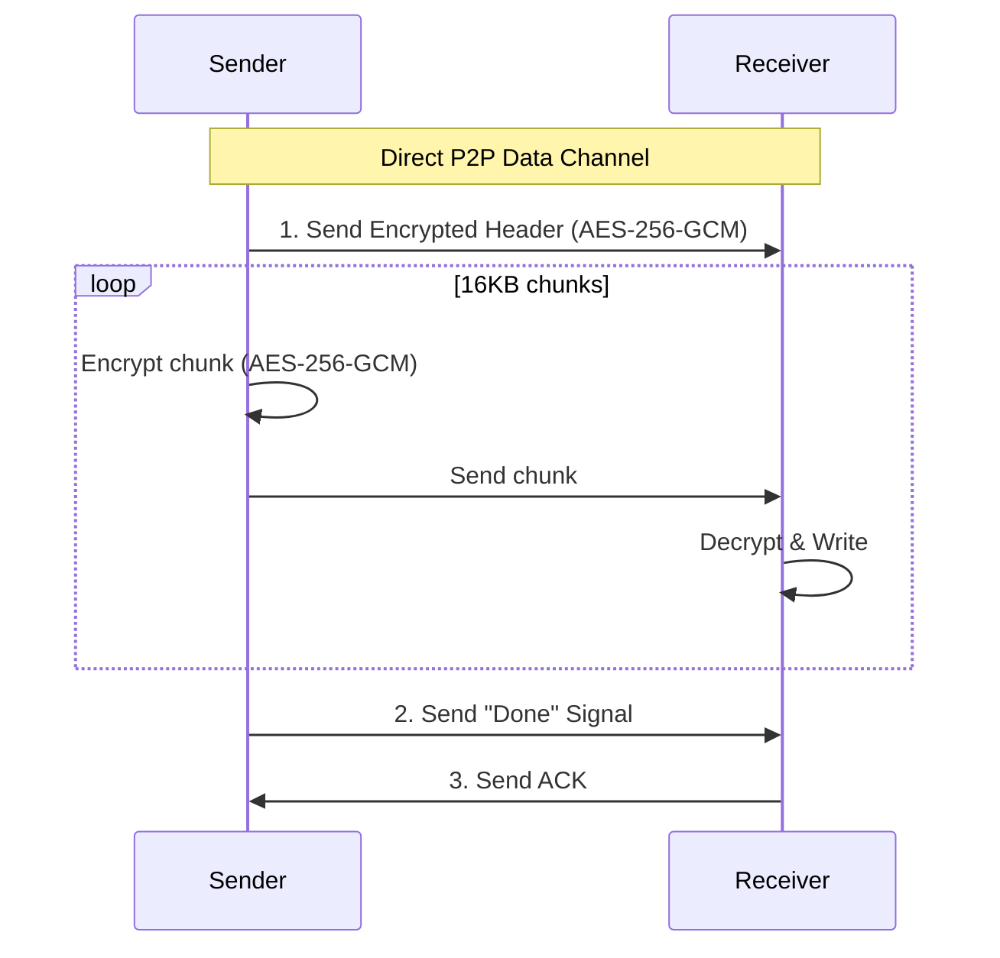
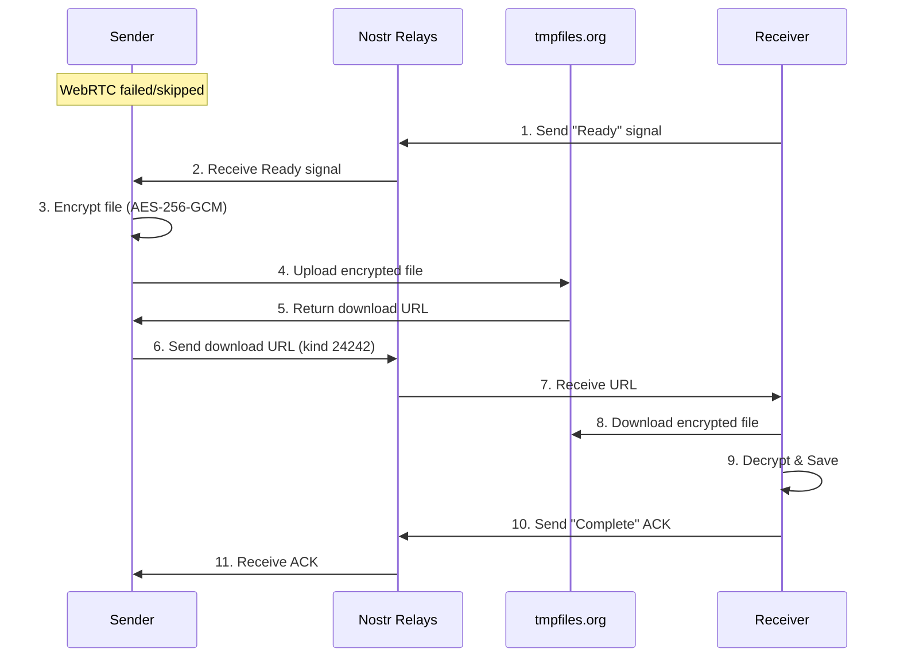
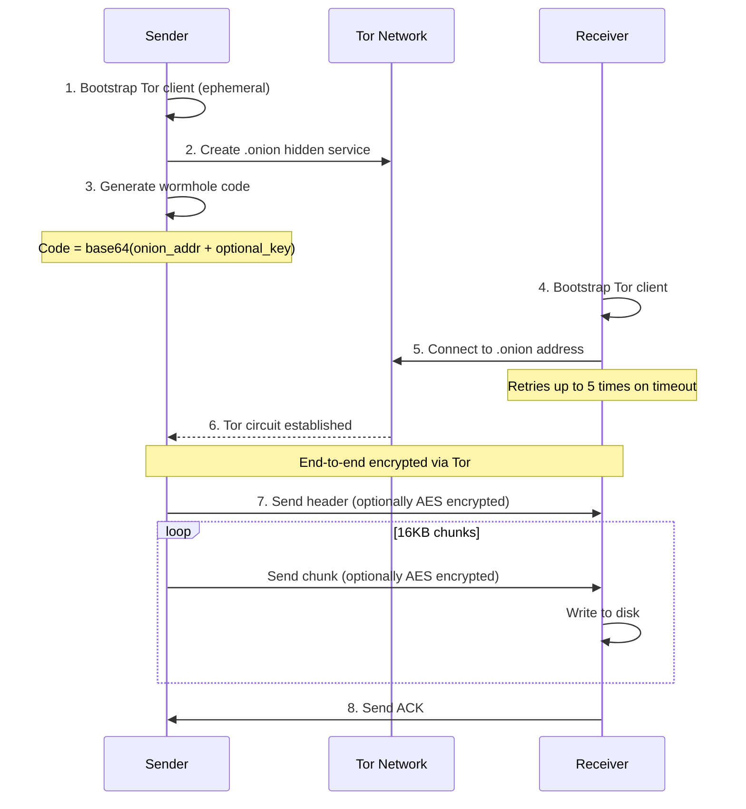
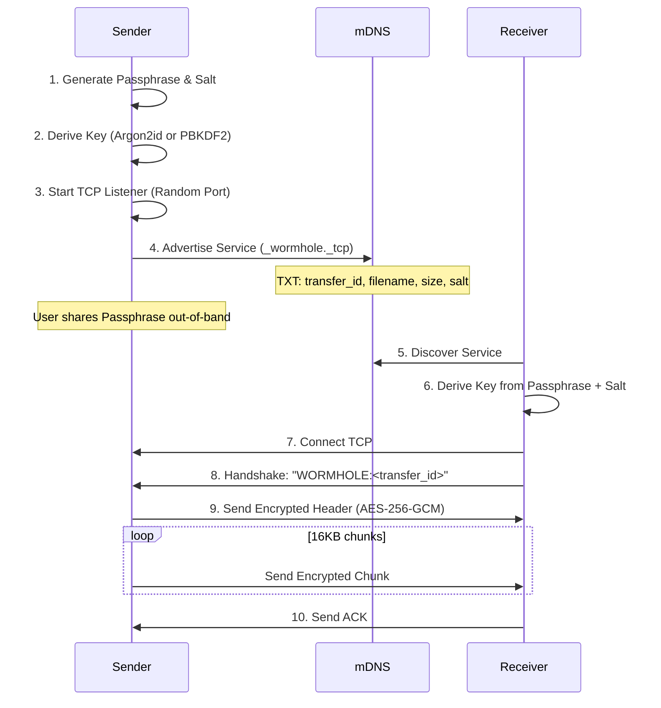

# Wormhole-rs Architecture

## Overview

This document provides a detailed walkthrough of the wormhole-rs implementation.

wormhole-rs supports two main categories of transport:

1. **Internet Transfers** (using `wormhole-rs send`):
   - **iroh mode** - Direct P2P transfers using iroh's QUIC/TLS stack (automatic relay fallback)
   - **WebRTC Mode**: For when direct UDP is blocked (uses WebRTC with Nostr signaling + relay fallback)
   - **Tor Mode**: For anonymity (uses `arti` to create hidden services)
2. **Local Transfers** (using `wormhole-rs send-local`):
    participant Relays as Nostr Relays
    participant Receiver

    Note over Sender: PIN Mode (Optional)

    Sender->>Sender: 1. Generate 12-char PIN
    Sender->>Sender: 2. Encrypt Wormhole Code with PIN
    Sender->>Relays: 3. Publish PIN Exchange Event (kind 24243)
    
    Receiver->>Receiver: 4. Enter PIN
    Receiver->>Relays: 5. Query for PIN hash
    Relays->>Receiver: 6. Return Encrypted Code
    Receiver->>Receiver: 7. Decrypt Wormhole Code
    
    Note over Receiver: Continues with Standard Flow below...

    Sender->>Sender: 1. Gen ephemeral keys (Nostr + AES)
    Sender->>Sender: 2. Create wormhole code
    Note over Sender: Code = base64(AES_key + Nostr_Pubkey + Relay_List)

    Sender->>Relays: 3. Connect & Listen for Offer

    Receiver->>Relays: 4. Connect & Send "Ready" (kind 24242)
    Sender->>Relays: 5. Send WebRTC Offer (SDP)
    Receiver->>Relays: 6. Send WebRTC Answer (SDP)
    
    par ICE Candidate Exchange
        Sender->>Relays: Send ICE Candidates
        Receiver->>Relays: Send ICE Candidates
    end

    Note over Sender,Receiver: WebRTC Data Channel Established
```

**2. Data Transfer (WebRTC Path)**



**3. Fallback Path (tmpfiles.org)**

If WebRTC fails or `--force-relay` is used:



#### Tor Mode



### 2. Local Transfers (Passphrase)

#### Local Mode (mDNS + TCP)

Local mode is designed for transfers on the same LAN without internet access. It uses a different security model based on a shared passphrase.



## Connection Types/Modes

### iroh Mode (`wormhole-rs send iroh`)
- **Transport**: QUIC / TLS 1.3
- **Discovery**: iroh's global discovery + mDNS
- **Relay**: iroh managed relays (derp) - automatically used if direct P2P connection fails
- **Encryption**: Always authenticated/encrypted by QUIC. Optional extra AES layer.

### WebRTC Mode (`wormhole-rs send webrtc`)
- **Transport**: WebRTC Data Channels (SCTP/DTLS)
- **Signaling**: Nostr Relays (JSON payloads)
- **Fallback**: tmpfiles.org (100MB limit, 60 min retention)
- **Encryption**: Mandatory AES-256-GCM for all application data (on top of DTLS).

### Local Mode (`wormhole-rs send-local`)
- **Transport**: Raw TCP
- **Discovery**: mDNS (Multicast DNS)
- **Key Exchange**: Short Passphrase (not a Wormhole Code)
- **Encryption**: Mandatory AES-256-GCM with key derived from ephemeral passphrase.
- **Port**: Random ephemeral port

### Tor Mode (`wormhole-rs send tor`)
- **Transport**: Tor Onion Services
- **Discovery**: Onion Address
- **Encryption**: Tor Circuit encryption + Optional extra AES.


## Security Model

### iroh's Built-in Encryption (Default)
Relies on TLS 1.3/QUIC. Key exchange happens via the `EndpointAddr` (embedded in wormhole code).
- **Confidentiality**: Strong (ChaCha20-Poly1305).
- **Authentication**: Mutual (Ed25519 keys).

### WebRTC Mode Encryption (WebRTC + Nostr)
Since signaling happens over public relays, we cannot trust the transport for key exchange.
- **Key Exchange**: Ephemeral AES-256 key generated by sender, put in Wormhole Code.
- **Confidentiality**: All Header/Chunk data is encrypted with AES-256-GCM BEFORE sending to WebRTC or Relay.
- **Signaling Privacy**: Metadata (SDP, ICE) is currently sent in plaintext JSON events (Kinds 24242). This reveals IP addresses to relays but NOT file contents.

### PIN-based Key Exchange
When `-pin` is used, the wormhole code itself is encrypted and stored on Nostr.
- **Key Derivation**: Argon2id (Salted, 3 passes, 64MB RAM) derives a key from the 12-character PIN.
- **Encryption**: The wormhole code is encrypted with AES-256-GCM using the derived key.
- **Discovery**: The encrypted payload is published to Nostr relays (Kind 24243) tagged with a partial hash of the PIN.
- **Security**: The relays see only the encrypted wormhole code. A brute-force attack would require attacking the Argon2id KDF.

### Local Mode Encryption
- **Key Exchange**: Passphrase displayed to user.
- **Derivation**: Key = KDF(Passphrase, Salt).
- **Confidentiality**: All data over TCP is AES-256-GCM encrypted.

### Tor Mode Security
- **Anonymity**: Sender/Receiver IPs hidden.
- **Encryption**: End-to-end via Tor.


